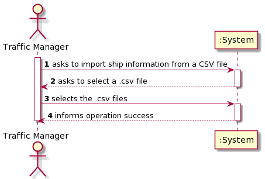
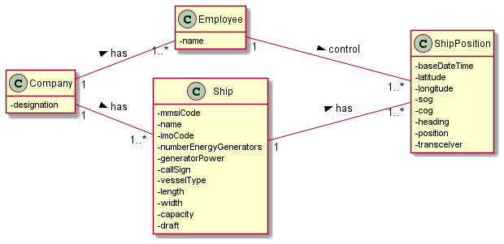
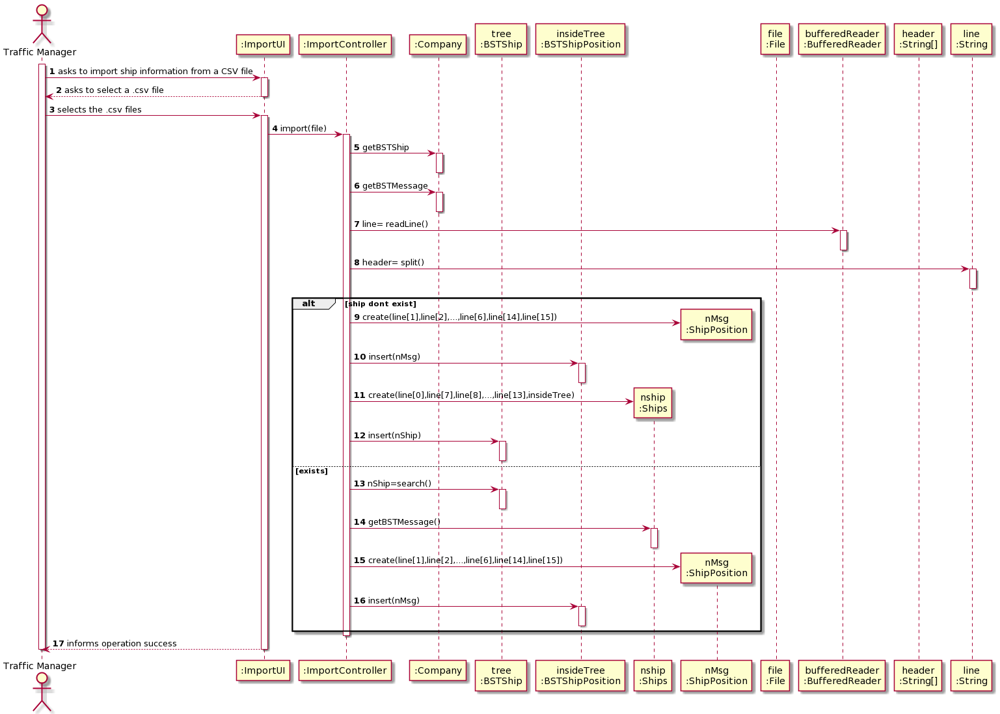
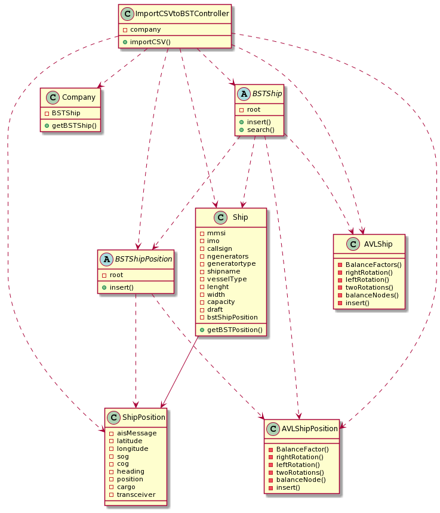

# US101

## Decision Making

* AVL: In this User Story, we decided to implement AVL so that the tree is always balanced, making sure the search is always efficient.
* COG: When receiving a negative cog, since we are talking about degrees, we decided to make a conversion to the respective positive degree.
* Heading: When receiving a negative heading, since we are talking about degrees, we decided to make a conversion to the respective positive degree.

## 1. Requirements engineering

### Brief format

The traffic manager wants to import information about ships fom a CSV file.
The system asks to select a CSV file.
The traffic manager selects the CSV file.
The system informs the traffic manager about the success of the operation.

### SSD

## 2. OO Analysis

### Excerpt from the Relevant Domain Model for US

## 3. Design - User Story Realization

### Sequence Diagram

### Class Diagram

