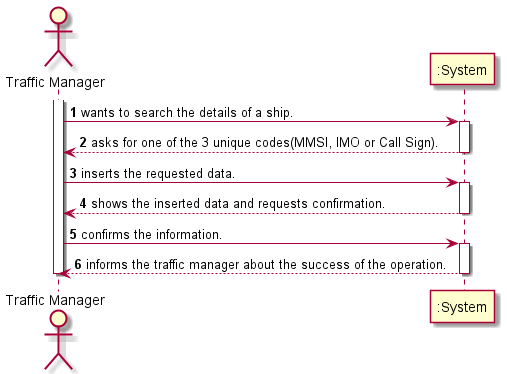
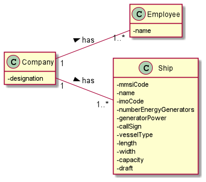
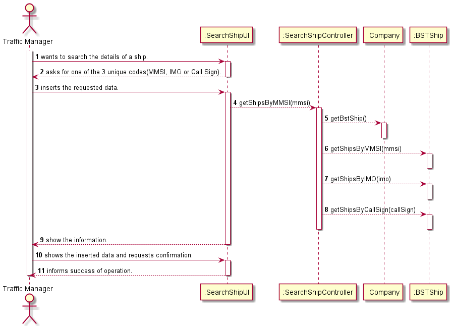
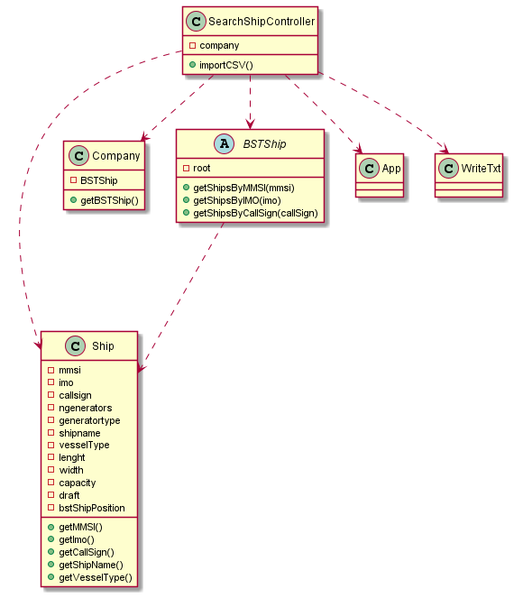

# US102

## Decision Making

* Still talking about the US101 and linking to the US102, during the creation, we
had the talk about creating 3 AVL for the 3 different types of unique codes, the
mmsi, imo and callsign, but we choose only creating one, opting for the mmsi
to be the ordering factor in the AVL, so we don’t have triplicated information
in the system, although the search by the other 2 unique attributes is not so
efficient.
  

## 1. Requirements engineering

### Brief format

The traffic manager wants to search the details of a ship.
The system asks for one of the 3 unique codes(MMSI, IMO or Call Sign) of the ship he wants to search.
The traffic manager inserts the requested data.
The system shows the inserted data and requests confirmation.
The traffic manager confirms.
The system display all the data about the ship and informs the traffic manager about the success of the operation.

### SSD

## 2. OO Analysis

### Excerpt from the Relevant Domain Model for US

## 3. Design - User Story Realization

### Sequence Diagram

### Class Diagram

