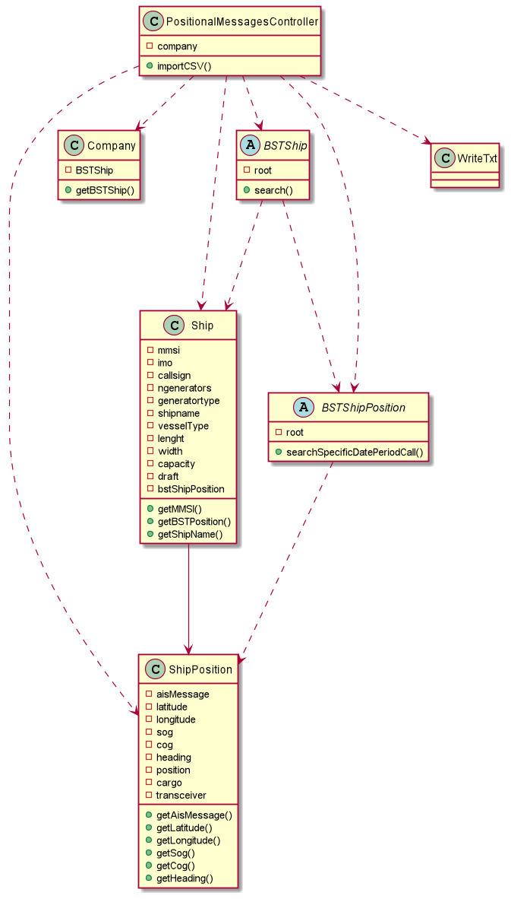

# US103

## Decision Making

* To verify the acceptance criteria, we decided to use a recursive search through the binary tree to get the values between two Dates, instead of using the iterator, so that the method is efficient.
  

## 1. Requirements engineering

### Brief format

### SSD

## 2. OO Analysis

### Excerpt from the Relevant Domain Model for US

## 3. Design - Use Story Realization

### Sequence Diagram

### Class Diagram

