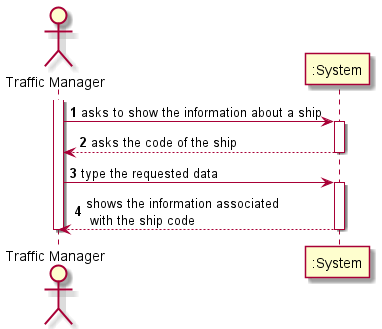
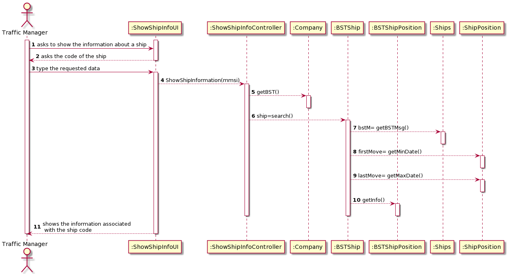
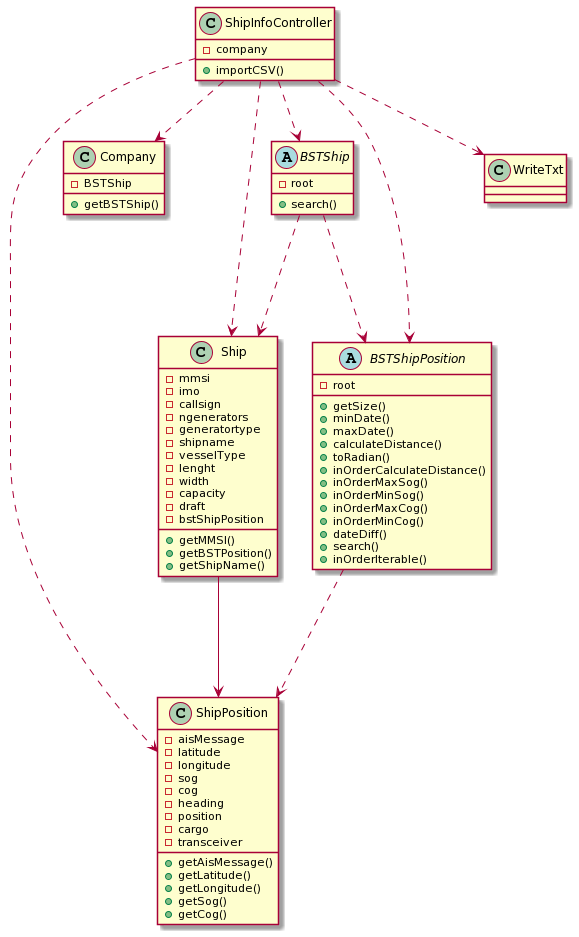

# US104

## Decision Making

* We decided to search the ship by mmsi code because it was the code we use to order the binary tree.

## 1. Requirements engineering

### Brief format

### SSD

## 2. OO Analysis

### Excerpt from the Relevant Domain Model for US

## 3. Design - User Story Realization

### Sequence Diagram

### Class Diagram

