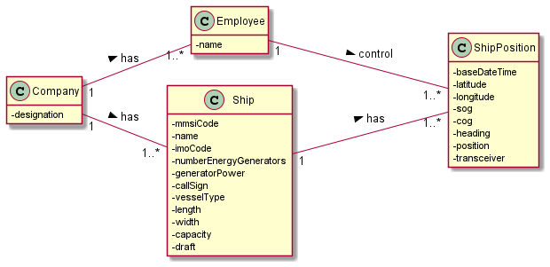

# US105

## Decision Making

* We decided to create a new class that contains the necessary information to
  do this user story, so it becomes easier and more organized. We also decided to print
  the output information in two different ways. The first one ordering the travelled
  distance by descending order, and the second one the total number of movements in
  ascending order, since it was our interpretation of the acceptance criteria.

## 1. Requirements engineering

### Brief format

### SSD

## 2. OO Analysis

### Excerpt from the Relevant Domain Model for US

## 3. Design - User Story Realization

### Sequence Diagram

### Class Diagram

