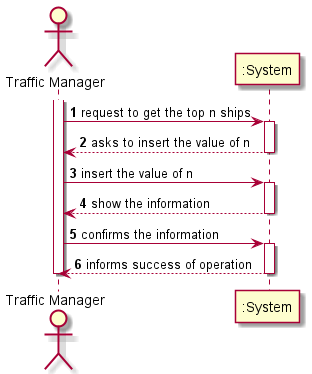
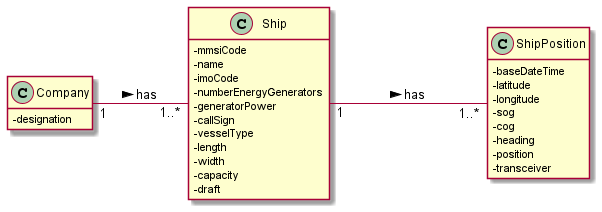
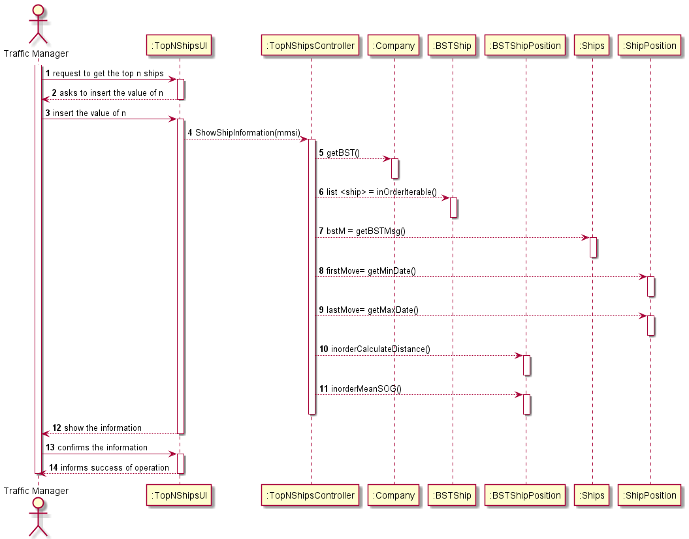
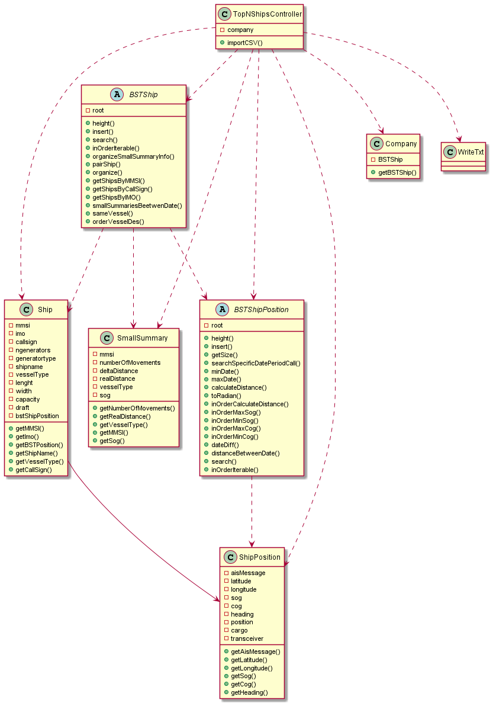

# US106

## Decision Making

*  In this user story we decided to use a map, so it becomes easier to organize
   the ships by vessel type, the key of the map is the vessel type and the value is a list of
   the ships. We also decided to create another constructor with the same intend of the US5.

## 1. Requirements engineering

### Brief format

### SSD

## 2. OO Analysis

### Excerpt from the Relevant Domain Model for US

## 3. Design - User Story Realization

### Sequence Diagram

### Class Diagram

