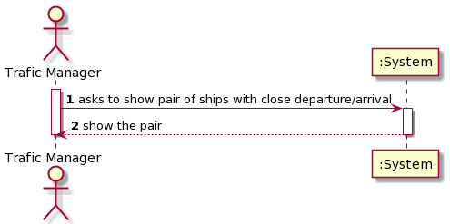
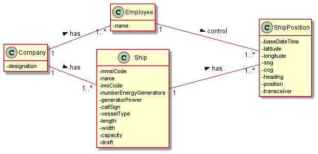
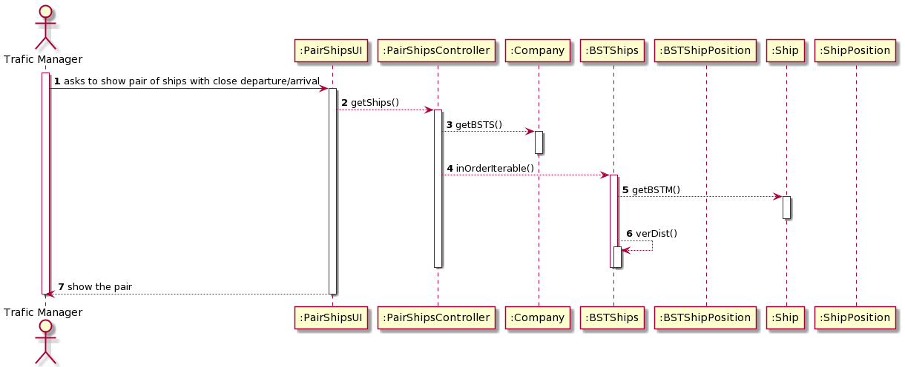
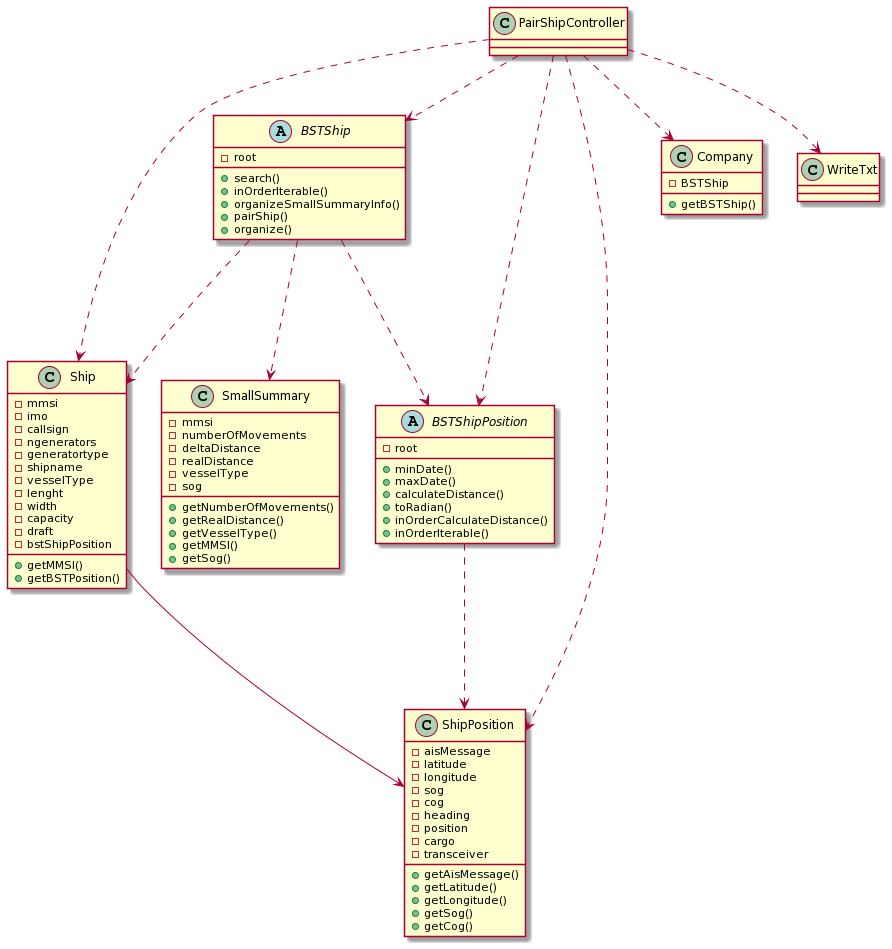

# US107

## Decision Making

* In this user story we decided to also use a map, so the key is a ship, and the
  value is a list of ships that meets the requirements needed. This makes easier to have the information grouped correctly.

## 1. Requirements engineering

### Brief format

### SSD

## 2. OO Analysis

### Excerpt from the Relevant Domain Model for US

## 3. Design - User Story Realization

### Sequence Diagram

### Class Diagram

