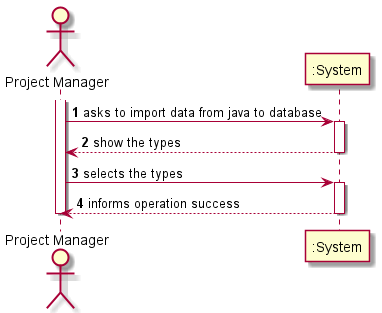
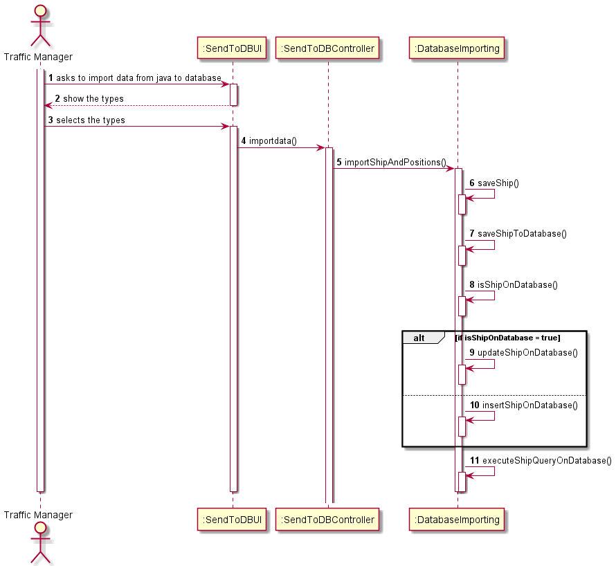

# US111

## Decision Making

* To perform this US we connected java to the database in order to be able to import from java the data from the business model objects to the database. To do this we iterated all the data that were in trees or stores and imported them one by one. To do the import we had to verify if the information to be inserted was already present in the database, if it was not, a normal insert was done, if it was, then an update was done. This verification is done by the primary key.

## 1. Requirements engineering

### Brief format

### SSD

## 2. Design - User Story Realization

### Sequence Diagram

