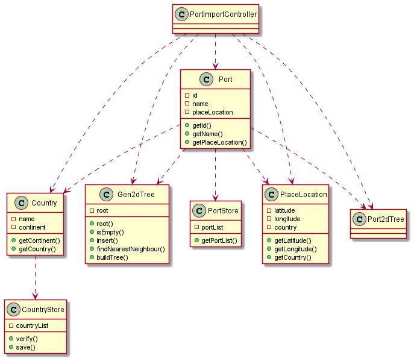

# US201

## Decision Making

* Since we need to look at two attributes to know where to put value to input, we had the need to use the KD-Trees. Since the KD-trees needed to be balanced to make the search method more efficient, we firstly input the ports of the file to a normal list and then, when the import to the list is finished, we send the list to a method that balances the tree. In this method we organize the values by X or Y depending on the line of the tree, and then select the medium value of that organized list. Then we do a sublist from 0 to that medium value until we only have 1 value on that list. After that, since its recursive, we go to the sublist done before, and do the same but with a sublist from the medium value to the size of the sublist. When discovering the first medium, that value become the root of the tree, then, every time we do the sublists, we define new nodes that will be connected to the first one, creating a tree that will be balanced and returned in the end.
  When the file to import as lines that cannot be imported, the line is not added to the list and a counter variable is incremented so we know how many lines were not imported.
  

## 1. Requirements engineering

### Brief format

### SSD

## 2. OO Analysis

### Excerpt from the Relevant Domain Model for US

## 3. Design - User Story Realization

### Sequence Diagram

### Class Diagram

