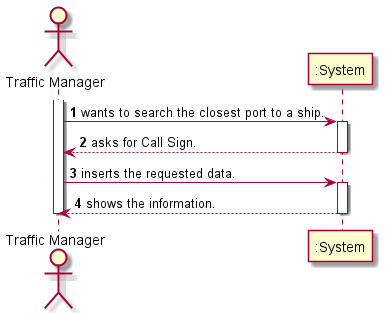
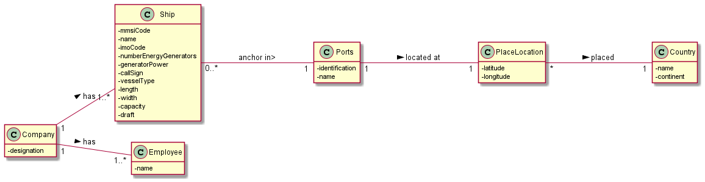
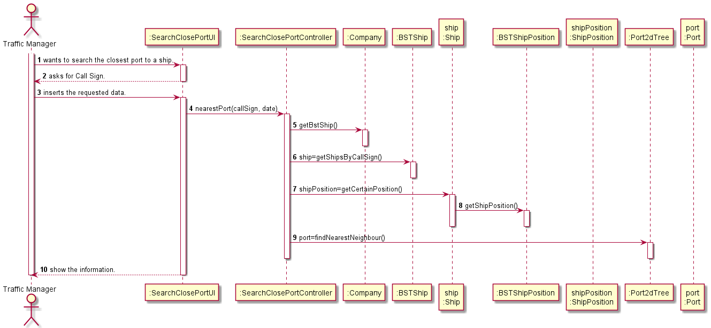
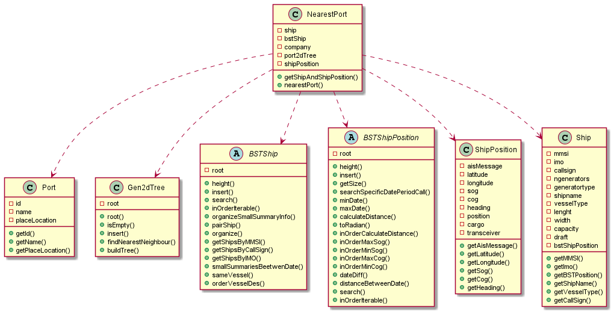

# US202

## Decision Making

* The nearest neighbor measures the distribution of something in a geographic space. It will provide the closest point, from the information stored in the ports, to the given ship at the given moment. If the given date does not exist in the ship position tree related to that ship or the ship does not exist, it will send the output message saying the ship or the date are invalid.
  

## 1. Requirements engineering

### Brief format

### SSD

## 2. OO Analysis

### Excerpt from the Relevant Domain Model for US

## 3. Design - User Story Realization

### Sequence Diagram

### Class Diagram

