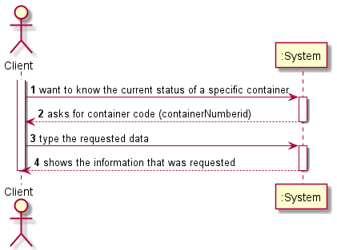
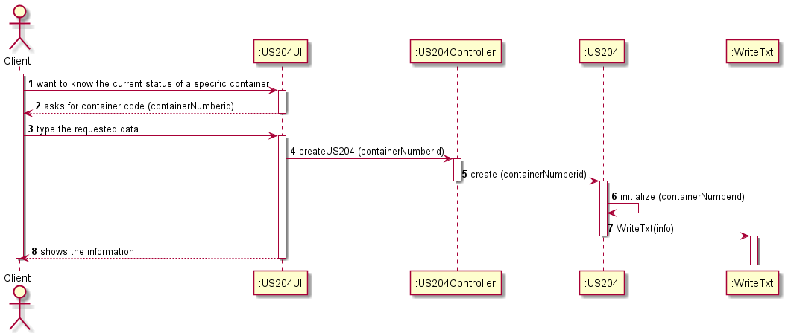

# US204

## Decision Making

* To find out the current situation of a specific container we use a cursor twice to check if the container is on a boat or in a port, if it is on a boat it enters the first cursor and the function ends, if it is in a port it enters the second cursor, because the return condition at the end of the first cursor is not met. On the first cursor if the Cargo Manifest Unload id is null we select the shipmmsi and store it in the variable v_shipmmsi, later in the ship table we collect the name of the ship associated with that mmsi. In the second cursor through the Trip id we access the Trip table, next we check the actual arrival date and assign the values of that date to another variable (v_datarealatual) in order to find out the most current actual arrival date, subsequently we collect the destination where the container is and store it in the v_destination variable.

## Requirements engineering

### SSD

## Design - User Story Realization

### Sequence Diagram

## Script of the User Story:

    -- US204 --

    CREATE OR REPLACE FUNCTION US204 (containerNumberid INT) RETURN VARCHAR IS

    cargoscode INT;
    cmucmu INT;
    v_shipmmsi INT;
    v_shipname VARCHAR(255);
    v_trip INT;
    v_datareal TIMESTAMP;
    v_portid INT;
    v_portname VARCHAR(255);
    v_datarealatual TIMESTAMP;
    v_cargoFinal integer;
    v_destination Varchar(255);
    counter Integer:=0;

    Cursor cargos IS
        Select cargoManifestLoadid
        from CargoManifest_Container
        where containerid=containerNumberid
        AND containerid=containerNumberid;

    BEGIN

    open cargos;
    LOOP
        fetch cargos INTO cargoscode;
        Exit When cargos%notfound;
        SELECT CargoManifestUnloadid INTO cmucmu
        FROM CargoManifest_Container
        WHERE cargoManifestLoadid=cargoscode
        AND containerId=containerNumberId;

        IF cmucmu is NULL THEN

        SELECT shipmmsi INTO v_shipmmsi
        FROM CargoManifestLoad
        WHERE id=cargoscode;

        SELECT name INTO v_shipname
        FROM Ship 
        WHERE mmsi=v_shipmmsi;

        return ('SHIP: ' || v_shipname);
        END IF;

    END LOOP;
    CLOSE cargos;

    open cargos;
    LOOP 
        fetch cargos INTO cargoscode;
        Exit When cargos%notfound;
        
        SELECT tripid INTO v_trip
        FROM CargoManifest_Container
        WHERE cargomanifestloadid=cargoscode
        AND containerid=containerNumberid;

        SELECT realArrivalDate INTO v_datareal
        FROM Trip
        WHERE cargoManifestLoadid=cargoscode
        AND id= v_trip;
                   
        counter := counter +1;
        
        IF counter = 1  then
            v_datarealatual:= v_datareal;
            v_cargoFinal:= cargoscode;
        ELSE IF counter > 1 AND v_datareal > v_datarealatual THEN
            v_datarealatual := v_datareal;
            v_cargoFinal:= cargoscode;
            END IF;
        END IF;
        
    END LOOP;
    CLOSE cargos;

        select destination INTO v_destination
        From Trip
        Where realArrivalDate = v_datarealatual
        AND cargomanifestloadId= v_cargoFinal;

        return ('Port: ' || v_destination);
    END;
