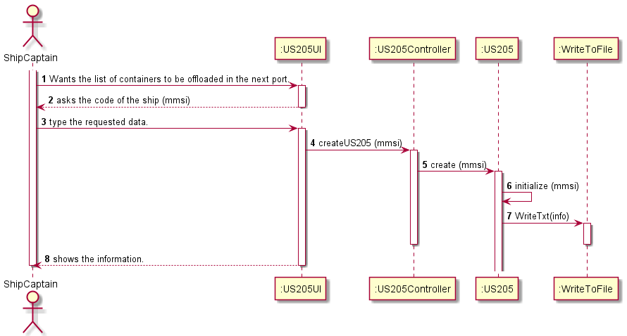

# US205

## Decision Making

* First, we create a cursor to iterate through all the Position Manifests for a given boat. For the next port to exist, then the manifest job of that ship has to be active, that is, it has more stops, so, to check if the manifest job was finished or not we compare the number of TRIPS with the number of Manifest Job Unload, that is, the number of trips has to be equal to the number of unloads, since a manifest job has several trips and in each trip it has to unload something in the respective destination port of the trip. If this number is not equal, the first time this condition is detected it means that it is the oldest active manifest post on the boat, that is, the one that dictates the boat's original route, so it will set the "next port". The "next port" is defined by checking how many Unload manifest posts exist, so we will know which is the last port where it stopped. Knowing the last port where you stopped, the next port is the destination of the trip where the origin is the last port. With the "next port" now defined let's check in the several active Manifests all the ones that have their next port equal to the one previously defined, if yes, the request is printed.
  

## Requirements engineering

### SSD

## Design - User Story Realization

### Sequence Diagram

## Script of the User Story:

    -- US205 --

    create or replace PROCEDURE US205 (mmsiCode in Varchar, output out Varchar) IS

    cmunloadNumber Integer;
    tripNumber Integer;
    cargoscode Cargomanifestload.id%type;
    proxLoc Trip.origin%type;
    nextPort Trip.origin%type;
    contador Integer :=0;
    typeIsoCode container.isoCode%type;
    loadWeight container.weight%type;
  
    Cursor cargos IS
    Select id
    from cargomanifestload
    where shipmmsi=mmsiCode
    Order by id;

    Begin
        open cargos;
        LOOP
        fetch cargos INTO cargoscode;
        Exit When cargos%notfound;
        dbms_output.put_line('cargo id: ' ||cargoscode); 
  
        SELECT Count(*) INTO cmunloadNumber
        FROM cargomanifestunload
        Where cargomanifestunload.cargomanifestloadid = cargoscode;

                dbms_output.put_line(cmunloadNumber);

                SELECT COUNT(*) INTO tripNumber 
                FROM Trip
                Where Trip.cargomanifestloadid = cargoscode;

                dbms_output.put_line(tripNumber);    

                IF tripNumber = cmunloadNumber THEN
                        dbms_output.put_line('cargo finalizado id: ' ||cargoscode);

                ELSE
                    select destination INTO proxLoc
                    from Trip                    
                    where id=cmunloadNumber+1
                    AND cargomanifestloadid= cargoscode;
                    dbms_output.put_line('proximo porto: ' ||proxLoc);

                    contador:= contador + 1;

                    IF contador=1 THEN
                        nextPort:= proxLoc;
                        output:=output||'Next Port: '|| nextPort || chr(10);
                    End IF;

                    IF proxLoc=nextPort THEN

                        FOR loop 
                        IN(Select cargomanifest_container.containerid,cargomanifest_container.xContainer,cargomanifest_container.yContainer,cargomanifest_container.zContainer 
                            from cargomanifest_container 
                            inner join Trip
                            on(cargomanifest_container.cargomanifestloadid = Trip.cargomanifestloadid)
                            where cargomanifest_container.cargomanifestloadid=cargoscode
                            AND cargomanifest_container.Tripid= cmunloadNumber+1
                            AND Trip.destination= proxLoc)
                        LOOP
                            dbms_output.put_line('asdasd: ' ||loop.containerid);
                            output:=output||'Container number: '|| loop.containerid|| ' With position-> x:'|| loop.xContainer|| ' y:' || loop.yContainer || ' z:'||loop.zContainer || chr(10);

                            select isoCode, weight into typeIsoCode, loadWeight
                            from container
                            where id= loop.containerid;

                            output:=output || 'Type(In iso Code): ' || typeIsoCode || ' Load: ' || loadWeight || chr(10);

                        END LOOP;

                    END IF;

                END IF;

            END LOOP;
        Close cargos;       
    END;

