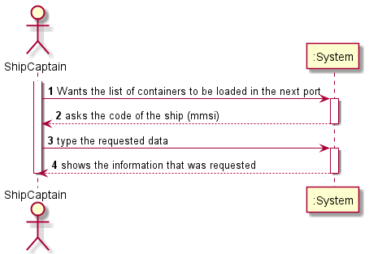
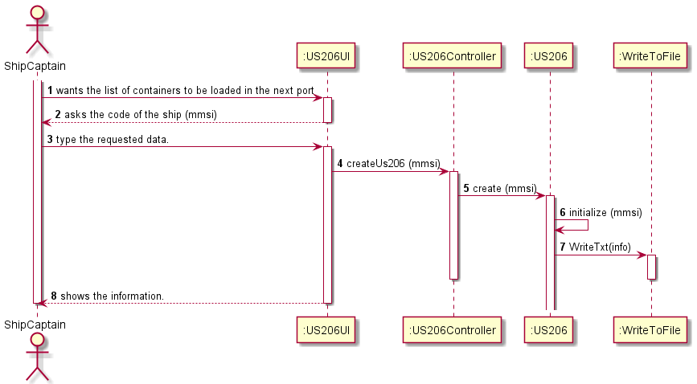

# US206

## Decision Making

* As expected from reading the statement, US206 has the very same basic reasoning as US205, so the method for figuring out the "next port" is the same as US205. Unlike US205, in this US you are asked to print the containers to be loaded. When a set of containers is loaded at a new port, a new cargo manifest is created, where the initial trip of this cargo manifest is the port in question. Taking this into account, already knowing the "next port", we will compare the initial trip of the later manifest post to the one that defined the "next port" and when this is equal it means that in the next defined port some amount of containers were loaded. Since it only loads once at the next port, the script can close after the discovery of the cargo manifest.
  

## Requirements engineering

### SSD

## Design - User Story Realization

### Sequence Diagram

## Script of the User Story:

    -- US206 --

    create or replace PROCEDURE US206 (mmsiCode in Varchar, output out Varchar) IS
        cmunloadNumber Integer;
        bool Boolean;
        tripNumber Integer;
        cargoscode Cargomanifestload.id%type;
        proxLoc trip.origin%type;
        contador Integer :=0;
        nextPort trip.origin%type;
        typeIsoCode container.isoCode%type;
        loadWeight container.weight%type;

        localToCompare Varchar(255);

        Cursor cargos IS
        Select id
        from cargomanifestload
        where shipmmsi=mmsiCode
        Order by id;

    Begin
        open cargos;
        LOOP
        fetch cargos INTO cargoscode;
        Exit When cargos%notfound;
        dbms_output.put_line('cargo id: ' ||cargoscode);
        SELECT Count(cargomanifestunload.cargomanifestloadid) INTO cmunloadNumber
        FROM cargomanifestunload
        Where cargomanifestunload.cargomanifestloadid = cargoscode;

                dbms_output.put_line(cmunloadNumber);

                SELECT COUNT(Trip.cargomanifestloadid) INTO tripNumber 
                FROM Trip
                Where Trip.cargomanifestloadid = cargoscode;

                dbms_output.put_line(tripNumber);    

                IF tripNumber = cmunloadNumber THEN
                        dbms_output.put_line('cargo finalizado id: ' ||cargoscode);

                ELSE
                    select destination INTO proxLoc
                    from Trip                    
                    where id=cmunloadNumber+1
                    AND cargomanifestloadid= cargoscode;
                    dbms_output.put_line('proximo porto: ' ||proxLoc);

                    contador:= contador + 1;

                    IF contador=1 THEN
                        nextPort:= proxLoc;
                        output:=output||'Next Port: '|| nextPort || chr(10);
                    End IF;

                    select origin into localToCompare
                    from trip
                    where id=1
                    AND cargomanifestloadid=cargoscode;

                    IF localToCompare = nextPort THEN

                        dbms_output.put_line('ID do cargo com os container a encher: ' ||cargoscode);
                        For loop
                        IN(select containerid 
                        from cargomanifest_container
                        where cargomanifestloadid= cargoscode)
                        LOOP
                            dbms_output.put_line('containers: ' ||loop.containerid);
                            output:=output ||'Container number: '|| loop.containerid || chr(10);

                            select isoCode, weight into typeIsoCode, loadWeight
                            from container
                            where id= loop.containerid;

                            output:=output || 'Type(In iso Code): ' || typeIsoCode || ' Load: ' || loadWeight || chr(10);

                        END LOOP;

                        Exit;
                    END IF;
                END IF;

            END LOOP;

            Close cargos;
    END;