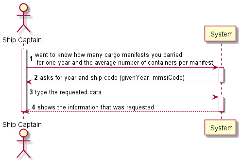
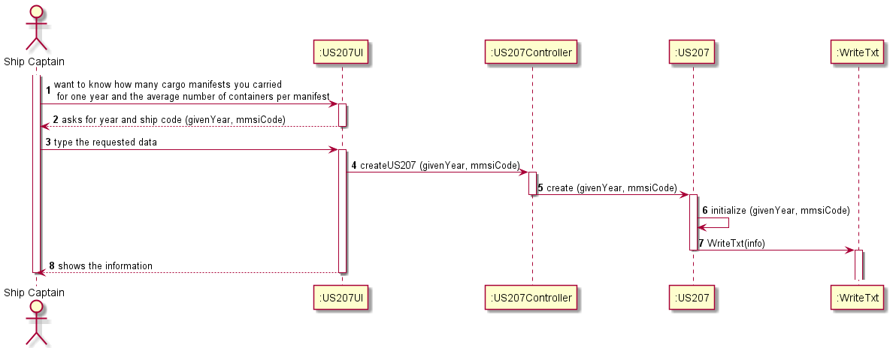

# US207

## Decision Making

* First, we create a cursor to iterate all finished Cargo Manifest of a ship received by parameter, this is because we only consider for this US the manifest positions that are finished in the defined year. The IsConcluded attribute with a value of 1 means that the Cargo Manifest Load has completed all of its TRIPS, whereas if the attribute is at 0 it means that the number of cargo manifest Unload is less than the number of TRIPS, i.e. it is not finished. Next, we will iterate through all the Cargo Manifest that meet the cursor condition. After this, we do a Select of the last step of that manifest job, to get its completion date. With the completion date stored in a variable, using the SQL function, EXTRACT, we are left with only the year stored in the variable. With the saved year we will compare it with the year provided by parameter and, if it is equal, it will increment the total number of job Manifests and then calculate the number of containers associated with that job manifest and add this value to a global sum variable. To finish, we divide the value of the variable that has the total number of containers by the variable with the total number of cargo Manifests to get the average number of containers per cargo manifest.

## Requirements engineering

### SSD

## Design - User Story Realization

### Sequence Diagram

## Script of the User Story:

    -- US207 --

    CREATE OR REPLACE PROCEDURE US207 (givenYear in INTEGER, mmsiCode in VARCHAR, totalCargoManifest out INTEGER, media out FLOAT) IS
    
    CURSOR cargoManifestsLoaded IS

    SELECT id
    FROM cargoManifestLoad
    WHERE shipMmsi = mmsiCode
    AND isConcluded = 1;

    lattestTrip INTEGER;
    yearOfCargo INTEGER;
    containerCargo INTEGER := 0;
    totalContainers INTEGER := 0;
    arrivalDate date;
    CargoManifestloadedid integer;

    BEGIN

    totalCargoManifest := 0;

    OPEN cargoManifestsLoaded;
    LOOP
    FETCH cargoManifestsLoaded INTO CargoManifestloadedid;
    EXIT WHEN cargoManifestsLoaded%NOTFOUND;

        SELECT realArrivalDate into arrivalDate
        FROM Trip
        WHERE cargoManifestLoadId = CargoManifestloadedid
        AND id = (select MAX(id) from trip where cargoManifestLoadId = CargoManifestloadedid);

        SELECT EXTRACT(YEAR FROM TO_DATE(arrivalDate,  'YY.MM.DD HH24:MI:SS')) INTO yearOfCargo
        FROM DUAL;

        IF yearOfCargo = givenYear THEN
            SELECT COUNT (*) INTO containerCargo
            FROM cargoManifest_Container
            WHERE cargoManifestLoadId = CargoManifestloadedid;
            totalContainers := totalContainers + containerCargo;

            totalCargoManifest := totalCargoManifest + 1;

        END IF;

    END LOOP;
    Close cargoManifestsLoaded;

    IF totalContainers = 0 OR totalCargoManifest = 0 THEN 
        media := 0;
    ELSE
        media := totalContainers/totalCargoManifest;
    END IF;

    END;