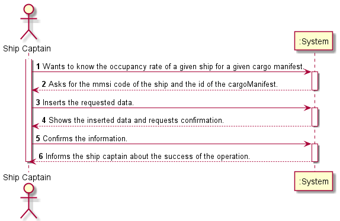
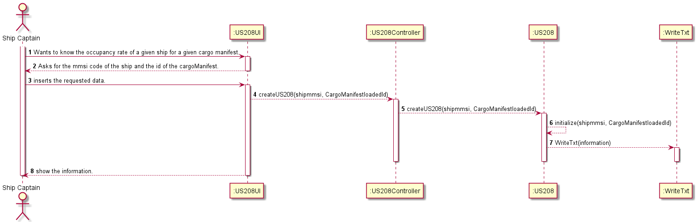

# US208

## Decision Making

* We decided to receive the id of a Cargo Manifest and its respective boat by parameter so that through these we can count the number of containers associated with both. After counting the number of containers, with the boat's code we will store its capacity in a variable. Finally, we'll divide the total number of containers in the given manifest by the capacity of the boat in question.
## Requirements engineering

### SSD

## Design - User Story Realization

### Sequence Diagram

## Script of the User Story:

    -- US208 --

    CREATE OR REPLACE PROCEDURE US208 (CargoManifestloadedId in INTEGER, shipmmsi in Varchar, occupancyRate out FLOAT) IS

    totalContainers INTEGER;
    shipCapacity FLOAT;

    BEGIN

    SELECT COUNT (*) INTO totalContainers
    FROM CargoManifest_Container 
    WHERE cargoManifestLoadId = CargoManifestloadedId;

    SELECT capacity INTO shipCapacity
    FROM Ship
    WHERE mmsi = shipmmsi;

    occupancyRate:= (totalContainers/shipCapacity)*100;

    END;
