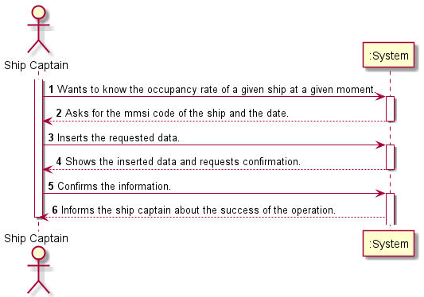
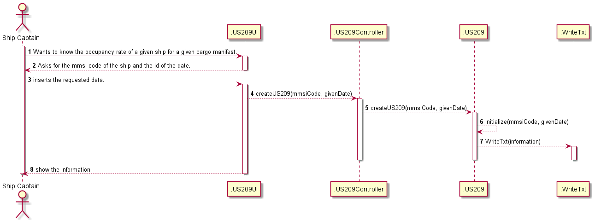

# US209

## Decision Making

* First, we create a cursor to iterate through all the Manifests positions of a given boat that is received by parameter, and in each iteration, we check if there is any TRIP in which the date received by parameter, is contained in the departure date and arrival date. If yes, we count the containers in that particular PHASE and its superior ones, because if the containers are leaving in step 2 they are present in step 1, dividing the final value by the boat capacity to get the percentage. The reasoning used for the percentage calculation was the same as for the previous US, only changing in the date verification, which led to not using it directly.

## Requirements engineering

### SSD

## Design - User Story Realization

### Sequence Diagram

## Script of the User Story:

    -- US209 --

    CREATE OR REPLACE PROCEDURE US209 (mmsiCode in VARCHAR, givenDate in timestamp, occupancyRate out FLOAT) IS

    CURSOR cargoManifestsloaded IS
    SELECT id
    FROM CargoManifestLoad
    WHERE shipMmsi = mmsiCode;

    totalContainers INTEGER;
    capacityShip FLOAT;
    cargoManifestsloadedId CargoManifestLoad.Id%type;
    date1 timestamp;
    date2 timestamp;
    numberOfTrip Integer;
    finalContainer Integer:=0;
    cont INTEGER;

    BEGIN

    OPEN cargoManifestsloaded;

    LOOP
        FETCH cargoManifestsloaded INTO cargoManifestsloadedId;
        EXIT WHEN cargoManifestsloaded%NOTFOUND;

        FOR trips IN
        (SELECT Trip.id
        FROM Trip
        WHERE Trip.cargoManifestLoadId = cargoManifestsloadedId)
        LOOP
            SELECT realDepartureDate, realArrivalDate, id INTO date1, date2, numberOfTrip
            FROM Trip
            WHERE id = trips.id
            AND cargoManifestLoadId = cargoManifestsloadedId;
                dbms_output.put_line(date1);
                dbms_output.put_line(date2);
                dbms_output.put_line('given date:'|| givenDate);

            IF (date1 <= givenDate AND date2 >= givenDate) THEN
                SELECT COUNT (*) INTO totalContainers
                FROM CargoManifest_Container
                WHERE tripId >= numberOfTrip
                AND cargoManifestLoadId = cargoManifestsloadedId;
                dbms_output.put_line(totalContainers);
                finalContainer:= finalContainer + totalContainers;
            END IF;
        END LOOP;

    END LOOP;

    Close cargoManifestsloaded;

    SELECT capacity INTO capacityShip
    FROM Ship
    WHERE mmsi = mmsiCode;

    occupancyRate:= (finalContainer/capacityShip)*100;

    END;