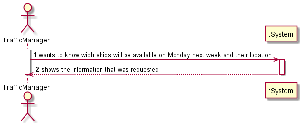
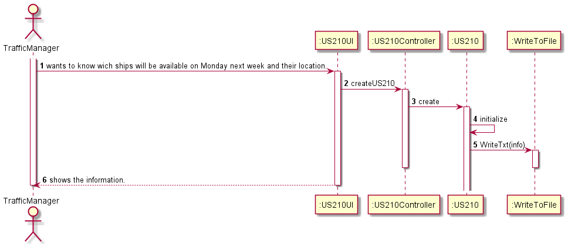

# US210

## Decision Making

* As this User Story asks to list all the boats that are available and their respective position, we first create a cursor to iterate over all the boats and after that another cursor to iterate over all the Manifests positions of each iterated boat. After having the cursors created, using the NEXT_DAY function, we can find out which is the next Monday to be counted by the system date. Next, we check for each manifest job of each boat if the expected date to finish its final TRIP is less than the date obtained by the NEXT_DAY function used earlier, if this happens is because the boat, in principle, because the date is expected, is available in the manifest job in question. If all the manifest positions for that boat meet the requirements mentioned above, we will search all the positions Manifests in the boat for the one with the closest end date to next Monday and its respective position. If the boat has no associated manifest positions, the User Story will list the boat's most recent position.

## Requirements engineering

### SSD

## Design - User Story Realization

### Sequence Diagram

## Script of the User Story:

    -- US210 --

    create or replace PROCEDURE US210 (output out VARCHAR2) IS

    ships VARCHAR(255);
    nextMonday DATE;
    cont INTEGER;
    arrivalDestination VARCHAR(255);
    nTrips INTEGER;
    arrivalDate DATE;
    lattestDate DATE;
    slatitude VARCHAR(255);
    slongitude VARCHAR(255);
    cargoManifestLoadedID INTEGER;
    totalCargoManifests INTEGER;
    counter INTEGER;
    finalDestination VARCHAR(255);
    flag BOOLEAN;

    CURSOR allShips IS
    SELECT mmsi FROM Ship;

    CURSOR cargoManifestsLoaded IS
    SELECT id FROM CargoManifestLoad
    WHERE shipMmsi = ships;

    BEGIN

        SELECT NEXT_DAY(sysdate,'SEGUNDA') INTO nextMonday FROM dual;

        output := output || 'Ships ready in next Monday (' || nextMonday || ')' || chr(10);

        OPEN allShips;

        LOOP
            FETCH allShips INTO ships;
            EXIT WHEN allShips%NOTFOUND;

            flag := false;
            nTrips := 0;
            cont := 0;

            OPEN cargoManifestsLoaded;

            LOOP
                FETCH cargoManifestsLoaded into cargoManifestLoadedID;
                EXIT WHEN cargoManifestsLoaded%NOTFOUND;

                flag := true;

                SELECT COUNT (*) INTO nTrips
                FROM Trip
                WHERE cargoManifestLoadId = cargoManifestLoadedID;

                SELECT expectedArrivalDate INTO arrivalDate
                FROM Trip
                WHERE id = nTrips
                AND cargoManifestLoadId = cargoManifestLoadedID;

                IF (arrivalDate < nextMonday) THEN
                cont := cont + 1;
                END IF;
        END LOOP;

        --Verificar se cont (conta todos os cm que acabam antes da proxima segunda) = total cargos--
        CLOSE cargoManifestsLoaded;

        IF flag=true Then
            SELECT COUNT (*) INTO totalCargoManifests
            FROM CargoManifestLoad
            WHERE shipMmsi = ships;

            IF cont = totalCargoManifests THEN
                counter := 0;
                OPEN cargoManifestsLoaded;
                LOOP

                    FETCH cargoManifestsLoaded into cargoManifestLoadedID;
                    EXIT WHEN cargoManifestsLoaded%NOTFOUND;

                    SELECT COUNT (*) INTO nTrips
                    FROM Trip
                    WHERE cargoManifestLoadId = cargoManifestLoadedID;

                    SELECT expectedArrivalDate, destination INTO arrivalDate, arrivalDestination
                    FROM Trip
                    WHERE id = nTrips
                    AND cargoManifestLoadId = cargoManifestLoadedID;

                    counter := counter + 1;

                    --Definir na primeira vez os valores para a comparaçao--
                    IF counter = 1 THEN
                        finalDestination := arrivalDestination;
                        lattestDate := arrivalDate;
                    END IF;
                    IF counter > 1 AND arrivalDate > lattestDate THEN
                        finalDestination := arrivalDestination;
                        lattestDate := arrivalDate;
                    END IF;
                END LOOP;

                CLOSE cargoManifestsLoaded;

                 output:= output || 'MMSI: '|| ships || ' Located at --> ' ||finalDestination|| chr(10);

            END IF;
        END IF;

            IF flag = false THEN

                SELECT latitude, longitude INTO slatitude, slongitude
                FROM ShipPosition
                WHERE shipMmsi = ships
                AND dateaismessage= (Select MAX(dateaismessage) from ShipPosition Where shipMmsi = ships);

                output := output || 'MMSI: '|| ships || ' Located at --> Latitude: ' || slatitude || ' Longitude: ' || slongitude || chr(10);
            END IF;
        END LOOP;
        CLOSE allShips;
    END;