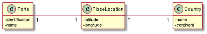

# US301

## Decision Making

* Since we received the data from a csv file, we firstly had to import the csv data to the database, so then we can import to make the graph. We decided that the graph should be oriented. Although the closest port and the capital relate to each other, the ports of the same country the same, when we are talking about the closest ports outside the country, a country A being the closest to a country B, doesn’t mean B is the closest to A.
  If the distance is between ports, we use the seadists given in the csv file, otherwise we use our method to calculate the distances.
  After creating the graph we use our toString method to see the graph in a output file.

## 1. Requirements engineering

### Brief format

### SSD

## 2. OO Analysis

### Excerpt from the Relevant Domain Model for US

## 3. Design - User Story Realization

### Sequence Diagram

### Class Diagram

