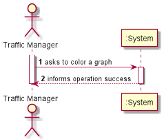

# US302

## Decision Making

* It was told to us that we should only consider countries when colouring the elements of the graph, so we had to create a list of the countries that were in the graph, so we could check if it was a country or a port.
  We then organize this list by degree so that the next step is correctly done.
  Now talking about the painting, we used a loop inside loop, the first loop being the colour we are using now, starting at 0. In the inside loop, we check every country and its neighbours, to see if the same colour is in any neighbour, if it isn’t, we paint. Making it this way, we will guarantee that in the first usage, every possible country will have colour 0, the second, every possible colour 1, all the way to the colour 4 (5 colours in total). We know that the max number of colours is 5 because of a mathematical rule.

## 1. Requirements engineering

### Brief format

### SSD

## 2. OO Analysis

### Excerpt from the Relevant Domain Model for US

## 3. Design - User Story Realization

### Sequence Diagram

### Class Diagram

