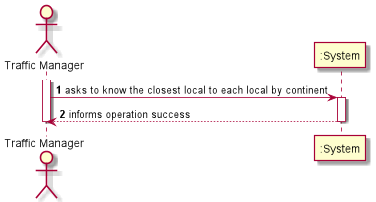
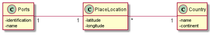
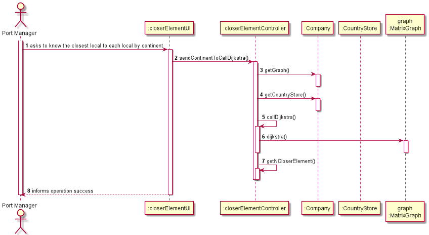
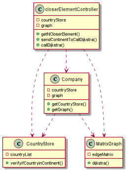

# US303

## Decision Making

* Since we wanted to know the closest element to every element of a continent, we decided to use the Dijkstra algorithm to calculate the distance of a given element to every other element. After all the distances are calculated we make the medium value and save it.
  After making that to all elements, we get the n smallest mediums. 
  In the Dijkstra algorithm we have and array that saves the distances between the first element and the others, and other array, this time of Booleans, to know which elements have already been used. We only update a distance in the first array if the weight of the connection plus the value that came from the last connection is less then the value to replace.
  When talking about different continents, the distance will be infinite, since we don’t want them to connect, neither to be in the medium value.

## 1. Requirements engineering

### Brief format

### SSD

## 2. OO Analysis

### Excerpt from the Relevant Domain Model for US

## 3. Design - User Story Realization

### Sequence Diagram

### Class Diagram

