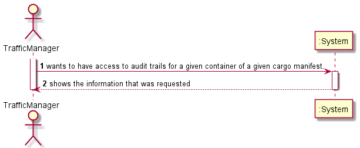

# US304

## 1. Requirements engineering

### Brief format

### SSD

## 2. OO Analysis

### Excerpt from the Relevant Domain Model for US

## 3. Design - User Story Realization

### Sequence Diagram

### Class Diagram

## Script of the User Story:

    -- US304 --

    CREATE OR REPLACE PROCEDURE US304 (CargoManifestloadedId in INTEGER, ContainerID in Integer, outString out VARCHAR2) IS

        opName Varchar(255);
    
        

    BEGIN
    
        FOR loop
        in(SELECT operationsId, userusername, dateofop,CARGOMANIFEST_CONTAINERCARGOMANIFESTLOADID,CARGOMANIFEST_CONTAINERCONTAINERID
        FROM audittrails
        where cargomanifest_containercontainerid = ContainerID
        AND cargomanifest_containercargomanifestloadid=CargoManifestLoadedId
        ORDER BY dateofop)
        LOOP
    
            select operationname into opName
            From operations
            where id = loop.operationsId;
        
        
        
            outString := outString || 'Cargo manifest id: ' || loop.CARGOMANIFEST_CONTAINERCARGOMANIFESTLOADID || ' Container id: '|| loop.CARGOMANIFEST_CONTAINERCONTAINERID || ' User name: ' || loop.userusername || ' Operation name: ' || opName || ' Date of change: '|| loop.dateofop|| chr(10);
        
    
            dbms_output.put_line('date: ' ||loop.dateofop);
            dbms_output.put_line('operation: ' ||opName);
            dbms_output.put_line('CARGOMANIFEST_CONTAINERCARGOMANIFESTLOADID: ' ||loop.CARGOMANIFEST_CONTAINERCARGOMANIFESTLOADID);
           
        END LOOP;

    END;

    -- US304 Trigger--

    create or replace TRIGGER audit_trail_trigger
    AFTER
    UPDATE OR DELETE OR INSERT
    ON cargoManifest_Container
    FOR EACH ROW
    DECLARE
    contador Integer;
    transactionStatus VARCHAR2(10);
    BEGIN
    -- determine the transaction type
    transactionstatus := CASE
    WHEN UPDATING THEN 1
    WHEN DELETING THEN 2
    WHEN INSERTING THEN 3
    END;

    select COUNT(*) Into contador from AuditTrails;
    contador:=contador +1;

        dbms_output.put_line('id: ' ||contador);
        dbms_output.put_line('id: ' ||:NEW.changesResponsible);
        dbms_output.put_line('id: ' ||transactionstatus);
        dbms_output.put_line('id: ' ||:NEW.cargomanifestloadid);

        --dbms_output.put_line('id: ' ||:NEW.containerid);

        -- insert a row into the audit table

        INSERT INTO  AUDITTRAILS
        VALUES(contador, :NEW.changesResponsible, transactionstatus, :NEW.cargomanifestloadid,:NEW.containerid,sysdate);
    END;

## Results

*  
