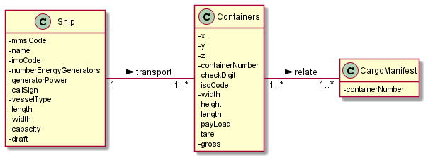
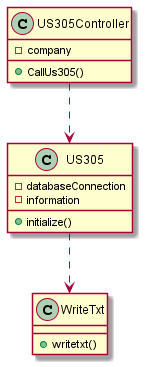
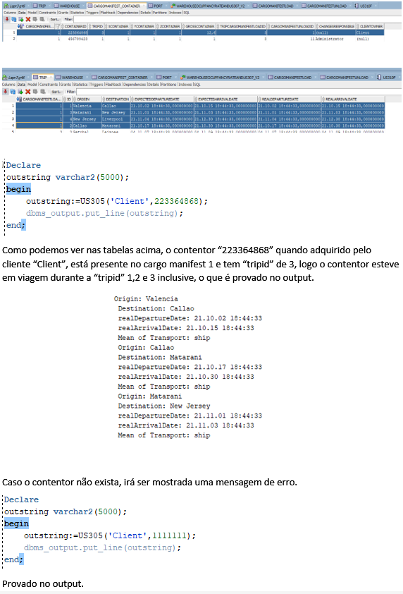
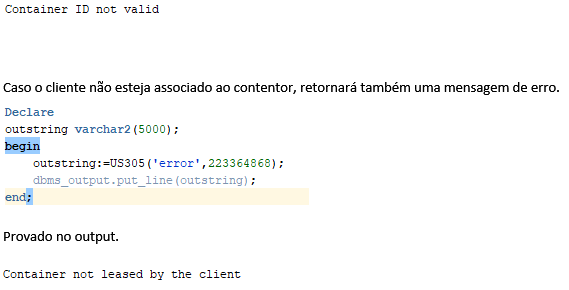

# US305

## 1. Requirements engineering

### Brief format

### SSD

## 2. OO Analysis

### Excerpt from the Relevant Domain Model for US

## 3. Design - User Story Realization

### Sequence Diagram

### Class Diagram

## Script of the User Story:

    -- US305 --

    CREATE OR REPLACE FUNCTION US305 (registration in VARCHAR, containerCode in INTEGER) RETURN Varchar2 IS

    v_leased INTEGER;
    v_identifier INTEGER;
    container_not_leased EXCEPTION;
    container_not_found EXCEPTION;
    outstring VARCHAR2(5000);

    CURSOR paths IS
    SELECT Origin, Destination, realDepartureDate, realArrivalDate, Shipmmsi, Truckregistration
    FROM users u JOIN CargoManifest_Container cmc ON u.username = cmc.clientOwner
    JOIN CargoManifestLoad cml ON cmc.CargoManifestLoadId = cml.id
    JOIN Trip t ON cml.id = t.CargoManifestLoadId
    WHERE u.username = registration and cmc.containerId = containerCode and t.id<=cmc.tripid;

    Begin
        SELECT Count(*) INTO v_identifier
        FROM users u JOIN CargoManifest_Container cmc ON u.username = cmc.clientOwner
        JOIN CargoManifestLoad cml ON cmc.CargoManifestLoadId = cml.id
        JOIN Trip t ON cml.id = t.CargoManifestLoadId
        WHERE cmc.containerId = containerCode;

	    IF v_identifier = 0 THEN 
		    RAISE container_not_found;
	    END IF;

	    SELECT Count(*) into v_leased
	    FROM users u JOIN CargoManifest_Container cmc ON u.username = cmc.clientOwner
	    JOIN CargoManifestLoad cml ON cmc.CargoManifestLoadId = cml.id
	    JOIN Trip t ON cml.id = t.CargoManifestLoadId
	    WHERE u.username = registration and cmc.containerId = containerCode;

	    IF v_leased = 0 THEN 
		    RAISE container_not_leased;
	    END IF;

	    FOR path in paths

	    LOOP 

		    outString:=outString || ' Origin: ' || path.Origin || chr(10);
		    outString:=outString || ' Destination: ' || path.Destination || chr(10);
		    outString:=outString || ' realDepartureDate: ' || path.realDepartureDate || chr(10);
		    outString:=outString || ' realArrivalDate: ' || path.realArrivalDate || chr(10);

		    IF (path.Shipmmsi IS NULL) THEN
	
		    outString:=outString || ' Mean of Transport: truck' || chr(10);

		    ELSE

		    outString:=outString || ' Mean of Transport: ship' || chr(10);
	
		    END IF;
	
	    END LOOP;
    
        RETURN outString;
	
	    EXCEPTION
            WHEN container_not_found THEN
                RETURN ('Container ID not valid');
            WHEN container_not_leased THEN
                RETURN('Container not leased by the client');

    END;

## Results

*  
  
*  