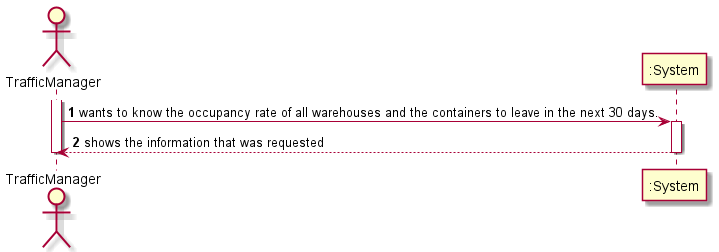

# US306

## 1. Requirements engineering

### Brief format

### SSD

## 2. OO Analysis

### Excerpt from the Relevant Domain Model for US

## 3. Design - User Story Realization

### Sequence Diagram

### Class Diagram

## Script of the User Story:

    -- US306 --

    create or replace PROCEDURE US306 (outString out Varchar) IS

    storehouse VARCHAR(255);
    cmucode INTEGER;
    finalDepDate DATE;
    ocp FLOAT;

    CURSOR warehouses IS
    SELECT name
    FROM warehouse;

    BEGIN
        finalDepDate:=sysdate+30;
    OPEN warehouses;
        LOOP

        FETCH warehouses INTO storehouse;
        EXIT WHEN warehouses%notfound;

        outString:=outString || ' Warehouse: ' || storehouse || chr(10);

        Select ocuppancyRate INTO ocp
        From warehouse
        where name=storehouse;

        outString:=outString || ' Ocuppancy Rate: ' || ocp || chr(10);

        outString:=outString || ' List of containers leaving the warehouse during the next 30 days: ' || chr(10);
        outString:=outString || ' Current Day ' || sysdate || chr(10);

        FOR loop
            IN(SELECT cargomanifestloadid, id, expectedDepartureDate 
            FROM Trip
            WHERE trip.origin=storehouse
            AND trip.expectedDepartureDate >= sysdate
            AND trip.expectedDepartureDate <= finalDepDate)
            LOOP

                FOR containers
                IN(SELECT ContainerId
                FROM CargoManifest_Container
                WHERE CargoManifestloadId=loop.cargomanifestloadid AND tripid=loop.id)
                LOOP

                    outString:=outString || 'Container: ' || containers.ContainerId || ' Expected Departure Date ' || loop.expectedDepartureDate || chr(10);

                END LOOP;

                dbms_output.put_line('cmu: '|| cmucode);

            END LOOP;
            outString:=outString || chr(10);
        END LOOP;
    END;

## Results

* 
  
*  
