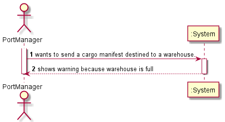
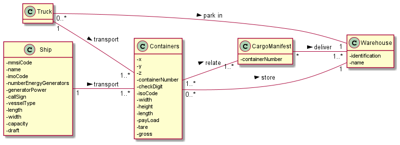
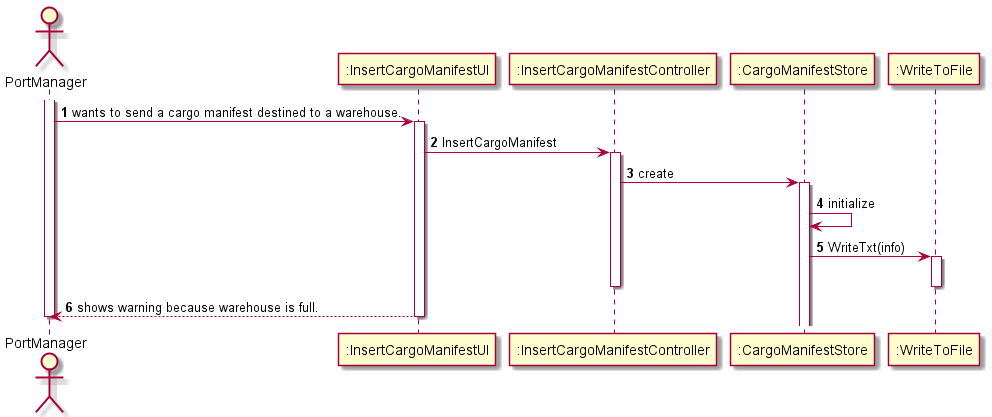
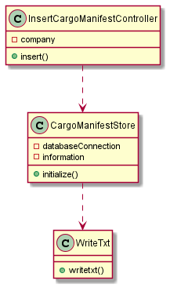
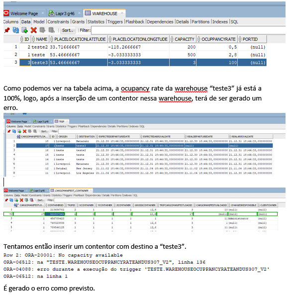

# US307

## 1. Requirements engineering

### Brief format

### SSD

## 2. OO Analysis

### Excerpt from the Relevant Domain Model for US

## 3. Design - User Story Realization

### Sequence Diagram

### Class Diagram

## Script of the User Story:

    -- US307 --

    create or replace Trigger WarehouseOcuppancyRateAndUS307_V2

    Before Insert OR DELETE
    ON CargoManifest_container
    FOR EACH ROW

    DECLARE

    dest INTEGER;
    numerator INTEGER := 0;
    lastDesiredcml INTEGER;
    cmload INTEGER;
    cmucode Integer;
    ocRate Float;
    cap Integer;
    destAux Varchar(255);
    contAux integer;
    flag Integer;
    total Integer :=0;
    tripaux integer;

    CURSOR cmu IS
    SELECT id
    FROM CargoManifestUnload
    WHERE CargoManifestUnload.warehouseid=dest;

    BEGIN

        IF INSERTING THEN

            Select destination into destAux
            from Trip
            where id=:NEW.tripid AND cargomanifestloadid=:NEW.cargomanifestloadid;

        ELSE

            Select destination into destAux
            from Trip
            where id=:OLD.tripid AND cargomanifestloadid=:OLD.cargomanifestloadid;

        END IF;

        Select COUNT(*) into flag
            from Warehouse
            where name=destAux;

        IF flag!=0 THEN

            Select id into dest
            from Warehouse
            where name=destAux;
        OPEN cmu;
    
        LOOP
            FETCH cmu INTO cmucode;
            EXIT WHEN cmu%notfound;

            dbms_output.put_line('cmu ' ||cmucode);

      SELECT CargoManifestLoadId, tripid INTO cmload,tripaux
            FROM CargoManifestUnload
            WHERE warehouseid=dest AND id=cmucode;

            dbms_output.put_line('cml ' ||cmload);

            For containers
            IN(SELECT ContainerId, cargoManifestLoadId
            FROM CargoManifest_Container
            WHERE CargoManifestUnloadId=cmucode AND CargoManifestLoadId=cmload AND tripid=tripaux)
            LOOP

                SELECT MAX(CargoManifestLoad.Id) INTO lastDesiredcml
                FROM CargoManifest_Container 
                INNER JOIN CargoManifestLoad
                ON (CargoManifestLoad.id=CargoManifest_Container.cargoManifestLoadId)
                WHERE ContainerId=containers.ContainerId;

                dbms_output.put_line('ldcml ' ||lastDesiredcml);

                IF containers.CargoManifestLoadId=lastDesiredcml THEN
                    numerator:=numerator+1;

                END IF;
                END LOOP;
            END LOOP;
            select capacity into cap
            from warehouse
            where id=dest;

            /*select COUNT(*) into contAux
            from cargoManifest_Container
            where cargomanifestloadid=:new.cargomanifestloadid
            AND tripid=:new.tripid;

            total := total + contAux;*/

            FOR cml
            IN(SELECT id
            from cargomanifestload
            where isConcluded is null)
            LOOP
                FOR trips
                IN(SELECT id
                from trip
                where cargomanifestloadid=cml.id
                and destination=destAux)
                LOOP
                    SELECT COUNT(containerId) INTO contAux
                    from cargomanifest_container
                    where cargomanifestloadid=cml.id
                    and tripid=trips.id;

                    total:=total+contAux;

                END LOOP;

            END LOOP;

            dbms_output.put_line('unloaded ' ||numerator);
            dbms_output.put_line('cap ' ||cap);
            dbms_output.put_line('total ' ||total);

            -- +1 por ser before, entao precisamos acrescentar o atual--
            ocRate:=((numerator+total+1)/cap)*100;

            dbms_output.put_line('ocr ' ||ocRate);
            
            IF ocRate > 100 THEN
                
                raise_application_error( -20001, 'No capacity available' );

            ELSE
                UPDATE Warehouse
                SET ocuppancyRate= ocRate
                where id=dest;
            
            END IF;
        END IF;

    END;

## Results

* 

