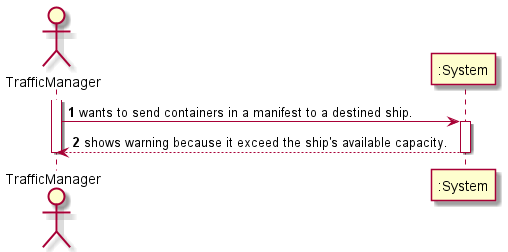
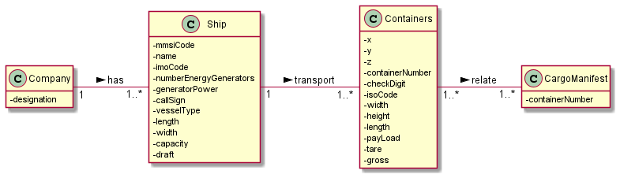
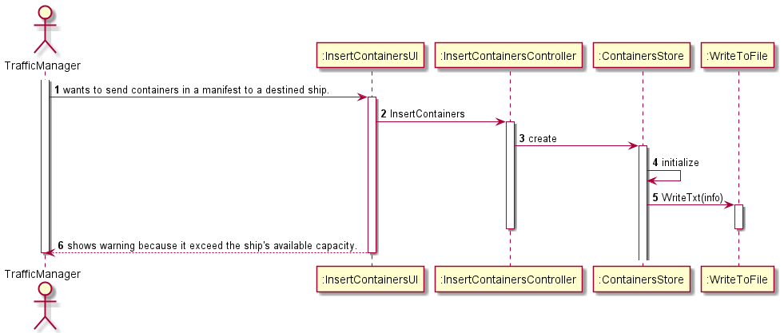
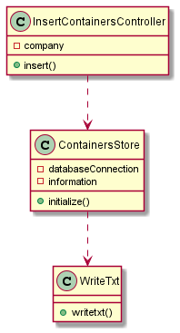
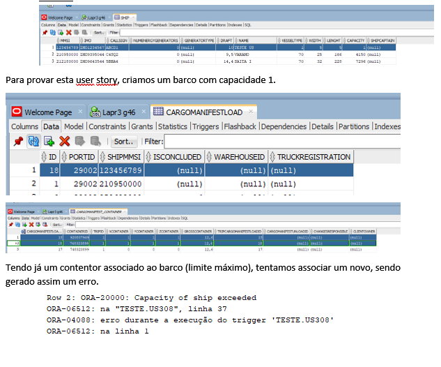

# US308

## 1. Requirements engineering

### Brief format

### SSD

## 2. OO Analysis

### Excerpt from the Relevant Domain Model for US

## 3. Design - User Story Realization

### Sequence Diagram

### Class Diagram

## Script of the User Story:

    -- US308 --

    create or replace Trigger US308

    Before Insert
    ON CargoManifest_Container
    FOR EACH ROW

    DECLARE

    cap INTEGER;
    totalContainers INTEGER :=0;
    cargo Integer;
    nContainers INTEGER;
    flag integer;

    CURSOR cm IS
    SELECT id
    FROM CargoManifestLoad
    WHERE isConcluded IS NULL AND shipMmsi = (SELECT shipMmsi FROM CargoManifestLoad WHERE id=:NEW.CargoManifestLoadId);

    BEGIN

    SELECT count(*) INTO flag
    FROM Ship
    WHERE Mmsi = (SELECT shipMmsi FROM CargoManifestLoad WHERE id=:NEW.CargoManifestLoadId);

    If flag>0 then
    SELECT capacity INTO cap
    FROM Ship
    WHERE Mmsi = (SELECT shipMmsi FROM CargoManifestLoad WHERE id=:NEW.CargoManifestLoadId);

        OPEN cm;
        LOOP
        FETCH cm INTO cargo;
                EXIT WHEN cm%notfound;
    
        SELECT COUNT(*) INTO nContainers
        FROM CargoManifest_Container
        WHERE cargoManifestLoadId = cargo;
    
        totalContainers:=totalContainers+nContainers;
    
                IF totalContainers+1 > cap THEN
                    raise_application_error( -20000, 'Capacity of ship exceeded');
        END IF;
        END LOOP;
        CLOSE cm;
    
        End if;
    END;

## Results

* 

