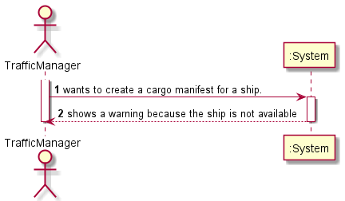
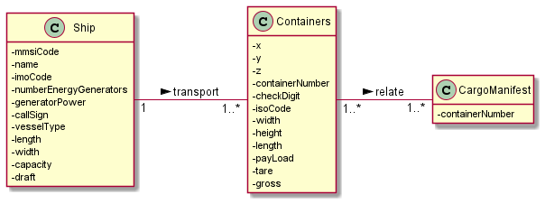
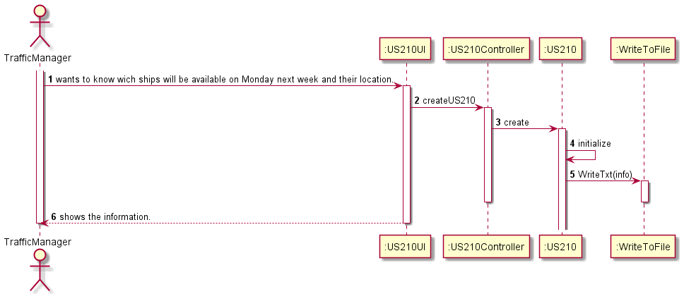
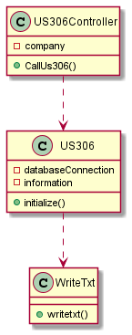
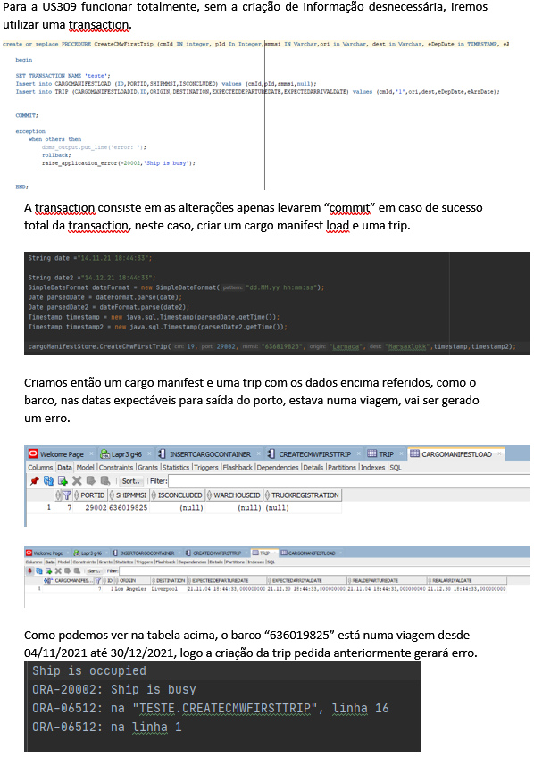

# US309

## 1. Requirements engineering

### Brief format

### SSD

## 2. OO Analysis

### Excerpt from the Relevant Domain Model for US

## 3. Design - User Story Realization

### Sequence Diagram

### Class Diagram

## Script of the User Story:

    -- US309 --

    create or replace PROCEDURE CreateCMwFirstTrip (cmId IN integer, pId In Integer,smmsi IN Varchar,ori in Varchar, dest in Varchar, eDepDate in TIMESTAMP, eArrDate in TimeStamp) IS

    begin

    SET TRANSACTION NAME 'teste';
    Insert into CARGOMANIFESTLOAD (ID,PORTID,SHIPMMSI,ISCONCLUDED) values (cmId,pId,smmsi,null);
    Insert into TRIP (CARGOMANIFESTLOADID,ID,ORIGIN,DESTINATION,EXPECTEDDEPARTUREDATE,EXPECTEDARRIVALDATE) values (cmId,'1',ori,dest,eDepDate,eArrDate);

    COMMIT;

    exception
        when others then
            dbms_output.put_line('error: ');
            rollback;
        raise_application_error(-20000,'Ship is busy');

    END;

    -- US309 Trigger --

    create or replace Trigger US309s

    Before Insert
    ON Trip
    FOR EACH ROW

    DECLARE

    cargos INTEGER;
    flag BOOLEAN:=false;
    ships VARCHAR(9);

    Cursor cml IS
        select id
        from CargoManifestLoad
        Where IsConcluded IS NULL
         And shipmmsi =ships;

    BEGIN

    SELECT shipmmsi into ships
    From CargoManifestLoad
    Where id=:NEW.cargomanifestloadid;

    open cml;
        Loop
            FETCH cml INTO cargos;
            EXIT WHEN cml%notfound;

            For loop
            IN(SELECT realDepartureDate, realArrivalDate
            FROM Trip
            Where cargomanifestloadid=cargos)
            LOOP
                IF :NEW.expectedDepartureDate > loop.realDepartureDate AND :NEW.expectedDepartureDate < loop.realArrivalDate THEN

                flag:= true;

                END IF;
            END LOOP;
        END LOOP;

        IF flag = true THEN
            raise_application_error(-20000,'Ship is busy');
        END IF;

    END;

## Results

* 
