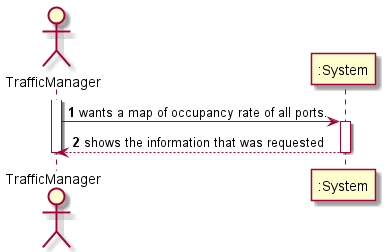
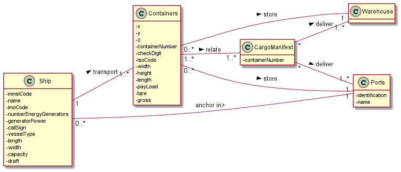
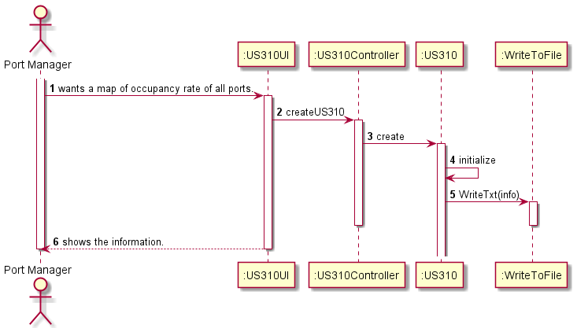
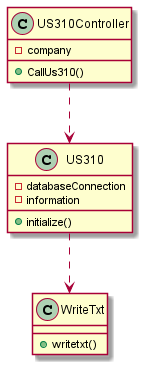
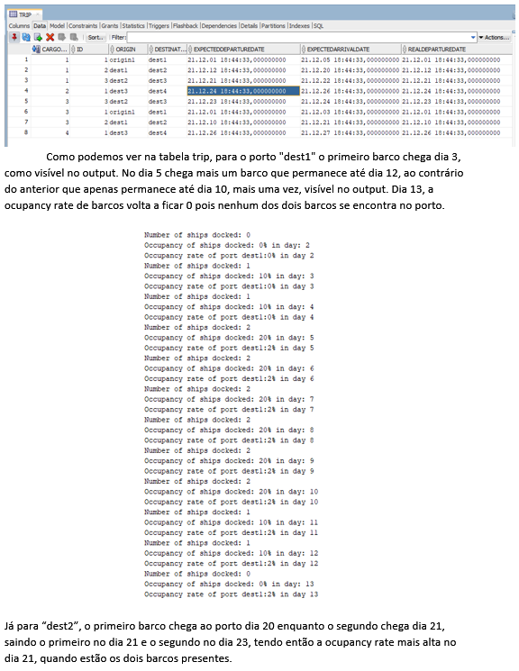
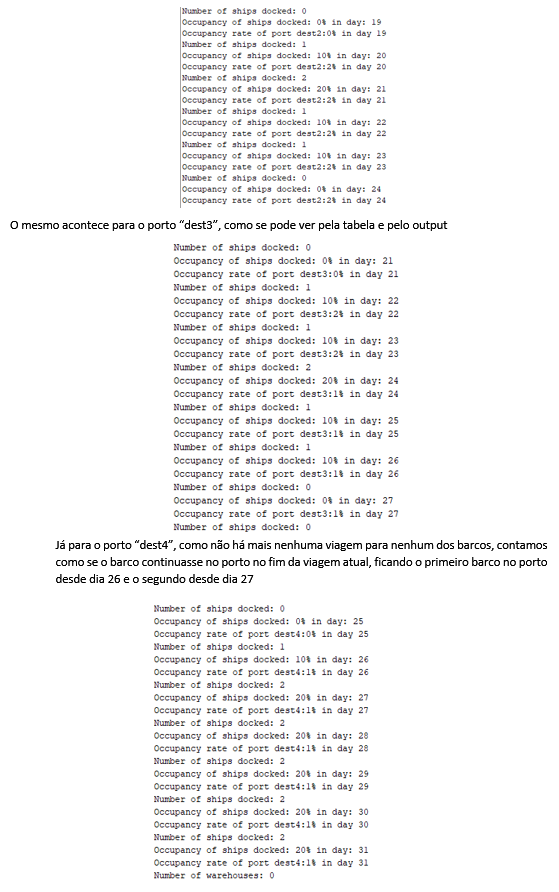
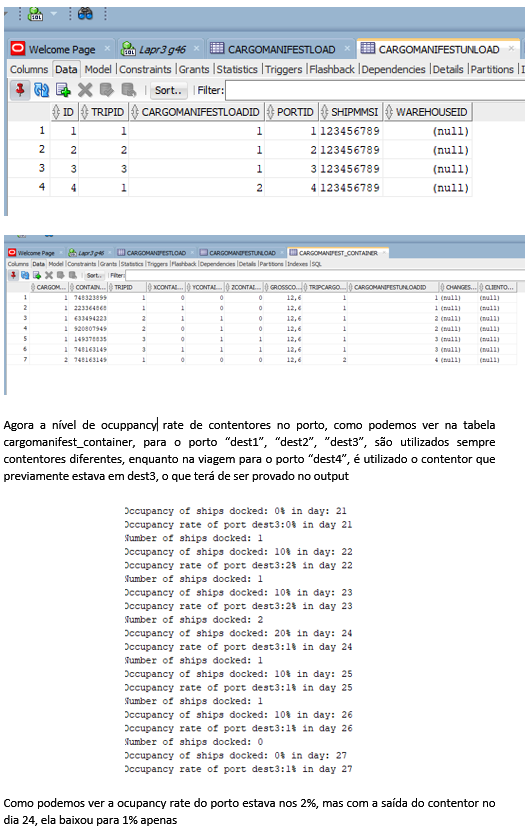
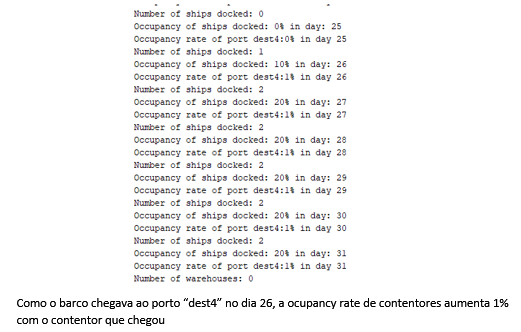

# US310

## 1. Requirements engineering

### Brief format

### SSD

## 2. OO Analysis

### Excerpt from the Relevant Domain Model for US

## 3. Design - User Story Realization

### Sequence Diagram

### Class Diagram

## Script of the User Story:

    -- US310 --

    create or replace PROCEDURE US310f (dmonth in integer,dyear in integer,  outString out CLOB) IS

        p integer;
        ships integer; 
        cWare integer:=0;
        num_of_days Integer;
        contador integer:=0;
        cml integer;
        tid integer;
        pName Varchar(255);
        Aux Varchar(255);
        auxDate TIMESTAMP;
        auxC Integer;
        auxContador Integer;
        numerator Integer :=0;
        ocR Float;
        cap Integer;
        Lastdesiredcml Integer;
        output varchar2(30000);

        Cursor ports is
        select id
        from port;

        begin
        dbms_lob.createtemporary(outString, true);

        open ports;
        LOOP
        FETCH ports into p;
        Exit when ports%notfound;

        select name into pName
        from port
        where id=p;

        output:= 'Port: ' || pName || chr(10);
        dbms_lob.append(outString, output);

        select capacityship,capacity into ships,cap
        from port
        where id=p;

        SELECT EXTRACT(DAY FROM LAST_DAY(to_date('01.'||dmonth||'.'||dyear||'','DD.MM.YYYY')))into num_of_days FROM DUAL;

        FOR var2 IN 1..num_of_days
        Loop
            contador:=0;
            auxContador:=0;
            numerator :=0;
            FOR loop
            IN(
            select id,destination,origin, cargomanifestloadid, expectedArrivalDate,expectedDepartureDate
            from trip
            where destination=pName or origin = pName)
            loop

                select count(*) into auxC
                from trip
                where cargomanifestloadid=loop.cargomanifestloadid; 

            IF loop.id-1 > 0 THEN

                select destination, expectedArrivalDate into aux, auxDate
                from trip
                where id=loop.id-1
                and cargomanifestloadid=loop.cargomanifestloadid;

                If auxC = loop.id THEN
                    IF loop.destination=pName AND var2>=EXTRACT(Day FROM (loop.expectedArrivalDate)) AND dmonth = EXTRACT(MONTH From loop.expectedArrivalDate) AND EXTRACT(Year from loop.expectedArrivalDate)<=dyear Then
                    select Count(*) into auxContador
                    from trip
                    inner join cargomanifestload
                    on(trip.cargomanifestloadid=cargomanifestload.id)
                    Where cargomanifestload.shipmmsi=(select shipmmsi from cargomanifestload where id=loop.cargomanifestloadid)
                    AND trip.expecteddeparturedate > loop.expectedArrivalDate
                    AND Extract(Day from trip.expecteddeparturedate)+1<=var2;

                    if auxContador=0 Then
                        contador:=contador+1;
                        End if;

                -->=2
                Elsif loop.origin= pName AND loop.origin=aux AND var2>=EXTRACT(Day FROM (auxDate)) AND var2<=EXTRACT(Day FROM (loop.expectedDepartureDate))AND dmonth = EXTRACT(MONTH From loop.expectedArrivalDate ) AND EXTRACT(Year from loop.expectedArrivalDate)<=dyear Then
                    contador:=contador+1;
               End if;
               elsif
                   loop.origin= pName AND loop.origin=aux AND var2>EXTRACT(Day FROM (auxDate)) AND var2<=EXTRACT(Day FROM (loop.expectedDepartureDate))AND dmonth = EXTRACT(MONTH From loop.expectedArrivalDate) AND EXTRACT(Year from loop.expectedArrivalDate)<=dyear Then
                    contador:=contador+1;

                eND if;

            ELSE 
                IF auxC=1 THEN
                    IF loop.destination=pName AND var2>=EXTRACT(Day FROM (loop.expectedArrivalDate)) AND dmonth = EXTRACT(MONTH From loop.expectedArrivalDate) AND EXTRACT(Year from loop.expectedArrivalDate)<=dyear Then
    --aqui o erro--

                    select Count(*) into auxContador
                    from trip
                    inner join cargomanifestload
                    on(trip.cargomanifestloadid=cargomanifestload.id)
                    Where cargomanifestload.shipmmsi=(select shipmmsi from cargomanifestload where id=1)
                    AND trip.expecteddeparturedate > loop.expectedArrivalDate
                    AND Extract(Day from trip.expecteddeparturedate)<=var2;

                    if auxContador=0 Then
                        contador:=contador+1;
                        End if;
                    END IF;
                ELSE
                    IF loop.destination=pName AND var2=EXTRACT(Day FROM (loop.expectedArrivalDate)) AND dmonth = EXTRACT(MONTH From loop.expectedArrivalDate) AND EXTRACT(Year from loop.expectedArrivalDate)<=dyear Then
                    contador:=contador+1;
                    END IF;
                --1
            END IF;
            END IF;

        END loop;

    output:= 'Number of ships docked: ' ||contador ||chr(10);
    dbms_lob.append(outString, output);

    output:= 'Occupancy of ships docked: ' ||(contador/ships)*100||'% in day: ' || var2 || chr(10);
    dbms_lob.append(outString, output);
    dbms_output.put_line('teste ' || p);

    For portsOc
    in(Select cargomanifestunload.id, cargomanifestunload.cargomanifestloadid, tripid
    from cargomanifestunload
    inner join trip
    on(cargomanifestunload.cargomanifestloadid=trip.cargomanifestloadid and cargomanifestunload.tripid=trip.id)
    where portid=p
    AND EXTRACT(Day from trip.expectedArrivalDate)<=VAR2
    AND ((EXTRACT(Month from trip.expectedarrivaldate)<=dmonth AND EXTRACT(Year from trip.expectedarrivaldate)=dyear)
    OR EXTRACT(Year from trip.expectedarrivaldate)<dyear))
    loop
        dbms_output.put_line('Ola ');
        dbms_output.put_line('portsOc.id '||portsOc.id);
        dbms_output.put_line(portsOc.cargomanifestloadid );
        dbms_output.put_line(portsOc.id );

        For containers
        IN(SELECT ContainerId
        FROM CargoManifest_Container
        WHERE CargoManifestUnloadId=portsOc.id AND CargoManifestLoadId=portsOc.cargomanifestloadid AND tripid=portsOc.tripid)
        LOOP

            dbms_output.put_line('container ' ||containers.containerId);

            SELECT MAX(CargoManifest_Container.cargomanifestloadid) INTO lastDesiredcml
            FROM CargoManifest_Container 
            INNER JOIN trip
            ON (CargoManifest_Container.cargoManifestLoadId = trip.cargomanifestloadid)
            WHERE ContainerId=containers.ContainerId
            AND EXTRACT(Day from trip.expectedDepartureDate)<=VAR2
            AND ((EXTRACT(Month from trip.expectedarrivaldate)<=dmonth AND EXTRACT(Year from trip.expectedarrivaldate)=dyear)
            OR EXTRACT(Year from trip.expectedarrivaldate)<dyear);

                dbms_output.put_line('ldcml ' ||lastDesiredcml);

                IF portsOC.CargoManifestLoadId=lastDesiredcml THEN
                    numerator:=numerator+1;

                END IF;
                END LOOP;
            END LOOP;

            ocR:=(numerator/cap)*100;

        output:= 'Occupancy rate of port ' ||pName || ':' || ocR ||'% in day ' || var2 || chr(10);
        dbms_lob.append(outString, output);

    End Loop;

    select count(*) into cWare
    from warehouse
    where portid=p;

    output := 'Number of warehouses: ' || cWare || chr(10);
    dbms_lob.append(outString, output);
    END LOOP;
    END; 

## Results

* 

*  
  
* 

*  