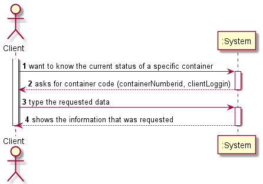
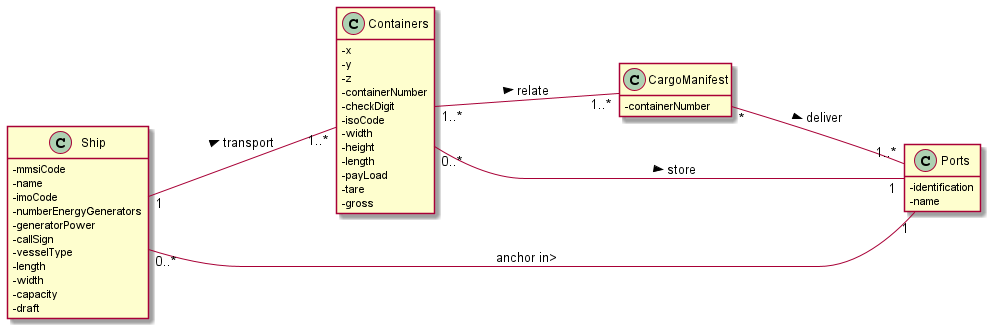
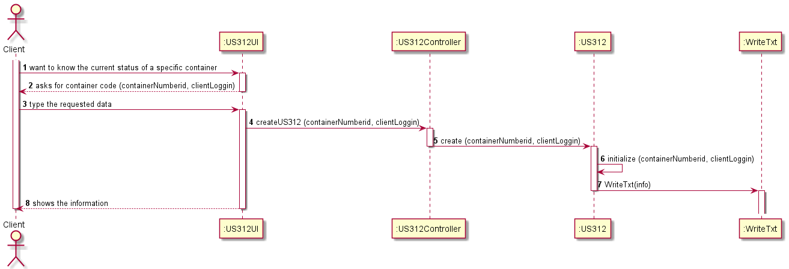
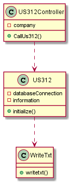
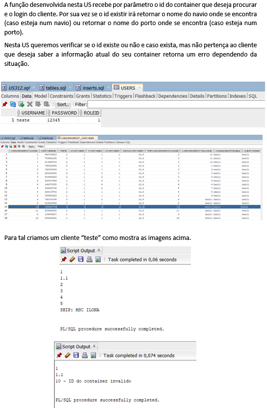
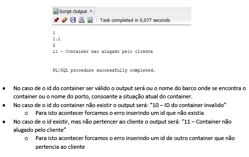

# US312

## 1. Requirements engineering

### Brief format

### SSD

## 2. OO Analysis

### Excerpt from the Relevant Domain Model for US

## 3. Design - User Story Realization

### Sequence Diagram

### Class Diagram

## Script of the User Story:

    -- US312 --

    CREATE OR REPLACE FUNCTION US312 (containerNumberid INT, clientLoggin VARCHAR) RETURN VARCHAR IS
        cargoscode INT;
        cmucmu INT;
        v_shipmmsi INT;
        v_shipname VARCHAR(255);
        v_trip INT;
        v_datareal TIMESTAMP;
        v_portid INT;
        v_portname VARCHAR(255);
        v_datarealatual TIMESTAMP;
        v_cargoFinal INTEGER;
        v_destination VARCHAR(255);
        counter INTEGER:=0;
        container_not_leased EXCEPTION;
        v_leased INTEGER;

    CURSOR cargos IS
        SELECT cargoManifestLoadid
        FROM CargoManifest_Container
        WHERE containerid=containerNumberid;
    BEGIN

    dbms_output.put_line('1');
    OPEN cargos;

    LOOP 
        FETCH cargos INTO cargoscode;
        dbms_output.put_line('1.1');
        EXIT WHEN cargos%notfound;
        
        dbms_output.put_line('2');
        
        
        SELECT COUNT(containerid) INTO v_leased FROM cargoManifest_container
        WHERE cargoManifestLoadid = cargoscode 
        AND clientOwner = clientLoggin;
        
        IF v_leased = 0 THEN
         RAISE container_not_leased;
        END IF;
        
        
        FOR ciclo_Container
        IN(SELECT containerid FROM cargoManifest_container
        WHERE cargoManifestLoadid = cargoscode 
        AND clientOwner = clientLoggin)
        LOOP 
        
        SELECT CargoManifestUnloadid INTO cmucmu
        FROM CargoManifest_Container
        WHERE cargoManifestLoadid=cargoscode
        AND containerId=ciclo_Container.containerid;
        dbms_output.put_line('3');

            
            
            IF cmucmu is NULL THEN

            SELECT shipmmsi INTO v_shipmmsi
            FROM CargoManifestLoad
            WHERE id=cargoscode;
            dbms_output.put_line('4');

            SELECT name INTO v_shipname
            FROM Ship 
            WHERE mmsi=v_shipmmsi;
            dbms_output.put_line('5');

            return ('SHIP: ' || v_shipname);
            END IF;
            dbms_output.put_line('6');
            END LOOP;
        END LOOP;
        CLOSE cargos;

    OPEN cargos;
    LOOP 
        FETCH cargos INTO cargoscode;
        EXIT WHEN cargos%notfound;
        
        SELECT tripid INTO v_trip
        FROM CargoManifest_Container
        WHERE cargomanifestloadid=cargoscode
        AND containerid=containerNumberid
        AND clientOwner = clientLoggin;
        
        SELECT realArrivalDate INTO v_datareal
        FROM Trip
        WHERE cargoManifestLoadid=cargoscode
        AND id= v_trip;
                   
        counter := counter +1;
        
        IF counter = 1  THEN
            v_datarealatual:= v_datareal;
            v_cargoFinal:= cargoscode;
        ELSE IF counter > 1 AND v_datareal > v_datarealatual THEN
            v_datarealatual := v_datareal;
            v_cargoFinal:= cargoscode;
            END IF;
        END IF;
        
        END LOOP;
        CLOSE cargos;

        SELECT destination INTO v_destination
        FROM Trip
        WHERE realArrivalDate = v_datarealatual
        AND cargomanifestloadId= v_cargoFinal;

        return ('Port: ' || v_destination);
       EXCEPTION
        WHEN no_data_found THEN
            RETURN ('10 - ID do container invalido');
        WHEN container_not_leased THEN
            RETURN('11 - Container nao alugado pelo cliente');
    END;

## Results

* 

* 
