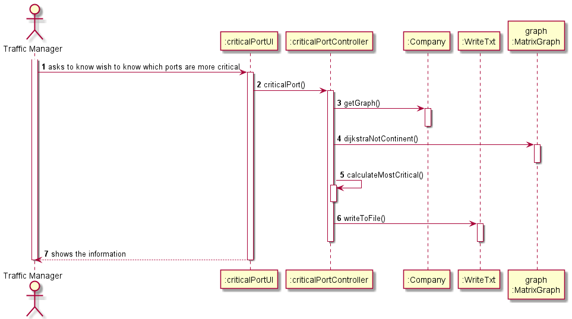

# US401

## Decision Making

* When using the Dijkstra algorithm, we create an array that stores every path last position before the next spot, so when the algorithm is done, we have a list of arrays, that has all the paths to the starting place.
  So, after calling that algorithm all we must do is count the number of times the places are passed by.
  To prove this algorithm in the class “Critical Port Controller Test” I have a commented method that proves the counter. For this method to work we need to change 1 line in the code, so that the graph and the arrays are equals.

## 1. Requirements engineering

### Brief format

### SSD

## 2. OO Analysis

### Excerpt from the Relevant Domain Model for US

## 3. Design - User Story Realization

### Sequence Diagram

### Class Diagram

