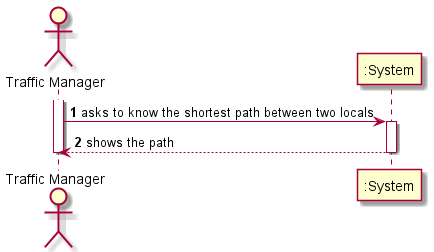
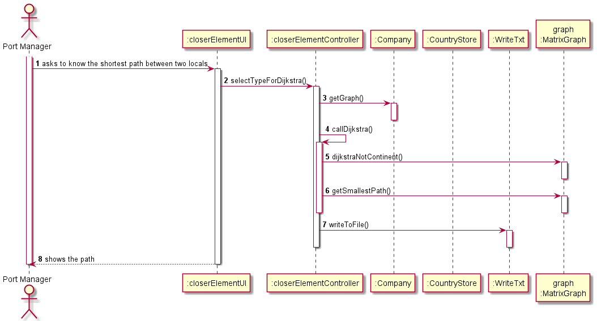
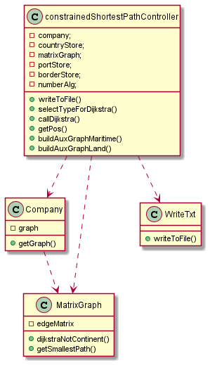

# US402

## Decision Making

* For this user story we decided to firstly do the shortest path between the first element and all the obligatory elements. After that, we check whose shortest path is smaller, after finding that, starting in that place we will do the shortest path to all the other obligatory places. After doing that to all places, we will do the shortest path beginning in the last obligatory place to the end place.
  This user story is proved used a link (//https://graphonline.ru/pt/?graph=aJfunVEsXRtDwZuK) that contains the same graph as we created using some files. In that website we can use the shortest path algorithm, and we can check that the algorithm we implemented, always choses the smallest options.

## 1. Requirements engineering

### Brief format

### SSD

## 2. OO Analysis

### Excerpt from the Relevant Domain Model for US

## 3. Design - User Story Realization

### Sequence Diagram

### Class Diagram

