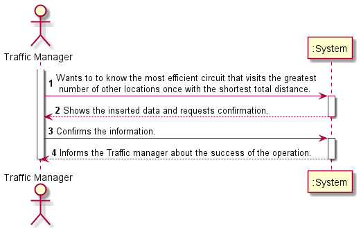

# US403

## Decision Making

* In this user story we decided to use the colored DFS algorithm, since in this algorithm we can visit adjacent vertices several times without creating a cycle, but if a vertical is visited before all adjacent vertices have been visited a cycle is created. To detect cycles, this algorithm assigns various colors to the vertices traversed: white(0) to initial vertices, gray(1) to vertices found, and black(2) when adjacent vertices of that vertices have all been visited. So, first it is checked which are the closest adjacent vertices to the chosen vertex and then visited in width, until the initial vertex is found again, when this happens it means that there is a circuit with it. Whenever the initial vertex is found it is checked if the current circuit has more locations than the largest previously found, if so, the latter is replaced. This algorithm is done until all nodes are traversed.

## 1. Requirements engineering

### Brief format

### SSD

## 2. OO Analysis

### Excerpt from the Relevant Domain Model for US

## 3. Design - User Story Realization

### Sequence Diagram

### Class Diagram

