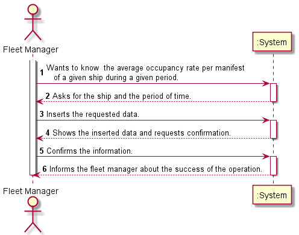
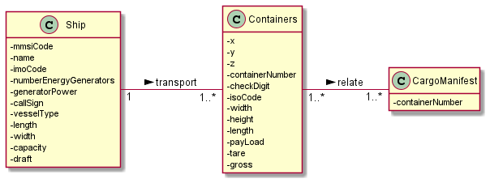
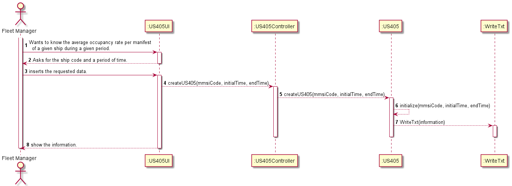
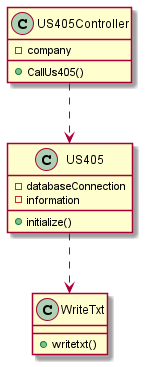
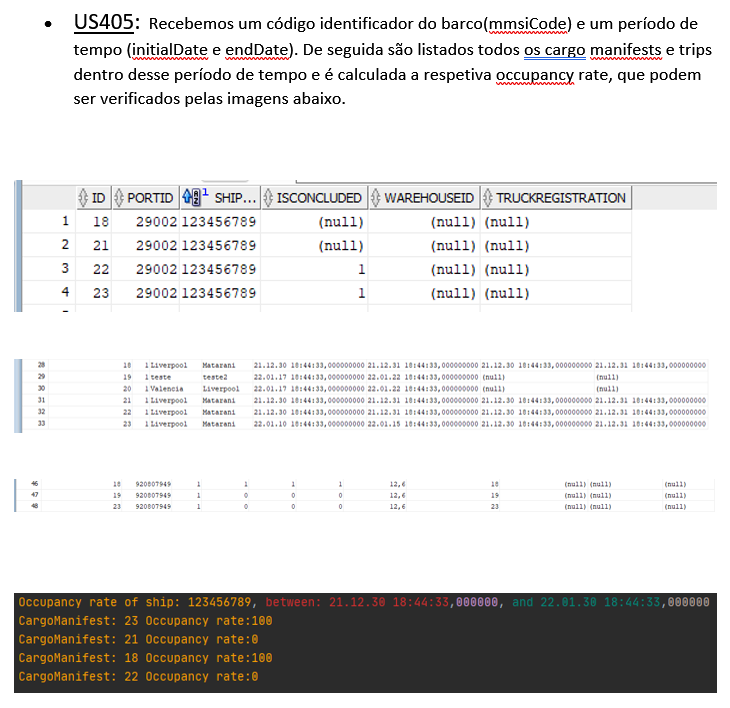

# US405

## 1. Requirements engineering

### Brief format

### SSD

## 2. OO Analysis

### Excerpt from the Relevant Domain Model for US

## 3. Design - User Story Realization

### Sequence Diagram

### Class Diagram

## Script of the User Story:

    -- US405 --

    CREATE OR REPLACE PROCEDURE US405 (mmsiCode in VARCHAR, initialTime in TIMESTAMP, endTime in TIMESTAMP, outString out VARCHAR2) IS

    cmlid INTEGER;
    ncontainers INTEGER :=0;
    cap INTEGER :=0;
    ocr FLOAT;
    totalContainers INTEGER :=0;

    CURSOR cm IS
    SELECT CargoManifestLoadId
    FROM Trip
    INNER JOIN CargoManifestLoad
    ON (CargoManifestLoad.id=Trip.CargoManifestLoadId)
    WHERE expectedDepartureDate>=initialTime AND expectedArrivalDate<=endTime AND CargoManifestLoad.shipmmsi=mmsiCode
    GROUP BY CargoManifestLoadId;

    BEGIN

        outString := outString || 'Occupancy rate of ship: '|| mmsiCode || ', between: ' || initialTime || ', and ' || endTime ||  chr(10);

        OPEN cm;
            SELECT capacity INTO cap
            FROM Ship
            WHERE mmsi=mmsiCode;
            LOOP   
                fetch cm INTO cmlid;
                Exit WHEN cm%notfound;
            
            for trips
            in(SELECT Trip.id FROM Trip INNER JOIN CargoManifestLoad ON (CargoManifestLoad.id=Trip.CargoManifestLoadId)
            WHERE expectedDepartureDate>=initialTime AND expectedArrivalDate<=endTime AND CargoManifestLoadId=cmlid)
                LOOP
                    
                    SELECT COUNT(*) INTO ncontainers
                    FROM CargoManifest_Container
                    WHERE tripId=trips.id AND CargoManifestLoadId=cmlid; 
                    totalContainers:=totalContainers+ncontainers;
                END LOOP;
                
                ocr := (totalContainers/cap)*100;
                
                outString := outString || 'CargoManifest: ' || cmlid || ' Occupancy rate:' || ocr ||   chr(10);
                
                totalContainers:=0;

            END LOOP;
        CLOSE cm;
    END;
    

## Results

* 